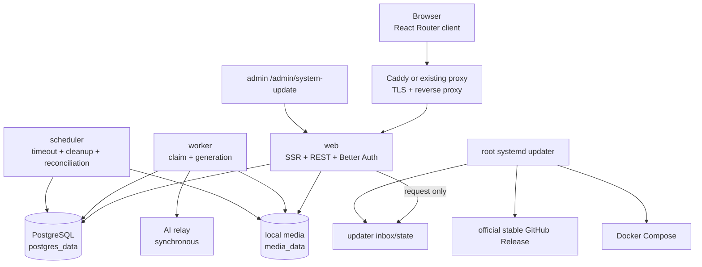

# 系统架构

状态：下图是当前 Debian Docker 单机生产拓扑。

`web`、`worker`、`scheduler` 使用同一应用镜像和生产配置，但运行不同命令。它们共享私有 PostgreSQL 与 `media_data`；Caddy 只读挂载媒体卷。PostgreSQL 不发布宿主机端口，Web 的容器端口 `3000` 也不会占用宿主机 `3000`。

更新链路刻意不把宿主机权限放进应用：Web 原子发布一个带管理员身份的 v1 请求，systemd path unit 唤醒 root oneshot。主机更新器在共享部署锁内重新校验请求、固定官方 Release、Git tag、版本和工作树，只有通过后才进入维护。迁移前可自动回滚；迁移边界后固定转入人工数据库恢复。

## 生成流程

1. 浏览器认证后调用 `POST /api/generate`。
2. Web 写入持久化 `generations(status='queued')`。system 模式执行余额、预算和并发闸；custom 模式原子写入任务级加密凭据。
3. Worker 原子领取未过期任务，调用 Relay，并把结果写入本地媒体卷。
4. system 成功事务写图片并 FIFO 扣费；custom 成功事务写图片但不碰本站积分。
5. 浏览器轮询 `GET /api/generate-status`，终态返回相对地址 `/media/<key>` 或脱敏错误。

`deadline_at` 是唯一超时依据。成功、失败和超时只更新符合状态谓词的在途行，避免终态互相覆盖；custom 凭据在终态立即删除。

## 媒体读取

- 内置 Caddy 模式直接从只读 `media_data` 响应 `/media/*`。
- 现有代理模式把所有请求转给 Web，由 `app/routes/media.$.ts` 安全读取同一卷。
- 路径是同源相对地址，因此更换域名或代理端口不会破坏历史图片。

## 定时任务

| UTC 时间 | 工作 |
|---|---|
| 每分钟 | generation deadline 重扫 |
| 每 5 分钟 | 过期 custom credential 清理 |
| 16:00 | 预算清理与前一日报告 |
| 16:10 | 积分过期 |
| 16:30 | 余额对账 |
| 17:00 | 过期图片与孤儿清理 |

每个时段只有成功后才标记完成；失败在当前时段重试。scheduler 状态是进程内状态，所以生产只能运行一个 scheduler 副本。

## 边界与扩展

- `generations` 始终是业务状态和队列真相源。
- 金额、兑换和调账保持 PostgreSQL 事务、行锁和幂等索引语义。
- 本地 PostgreSQL/媒体是自托管默认值；Neon 与 S3 兼容适配器仅用于明确选择的外部部署。
- 先按指标增加 worker。只有 PostgreSQL polling 成为实测瓶颈时才评估 Redis/Valkey + BullMQ。
- 多机高可用和自动异地备份不属于当前单机架构范围。
