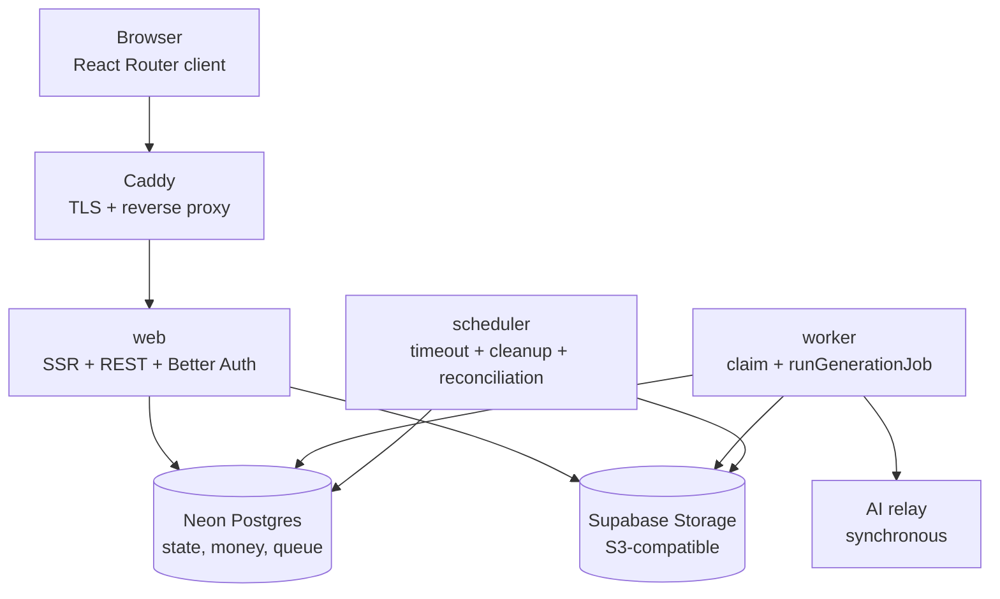

# 系统架构

状态：下图描述 Docker 目标运行时。生产切换尚未执行。

Only Caddy publishes host ports. Web, worker, and scheduler share one image and
production environment file but have separate commands. Docker Compose starts one
scheduler; worker replicas can scale only after load testing because job claiming
is already atomic.

## Generation Flow

1. Browser calls `POST /api/generate` after authentication and validation.
2. Web writes a durable `generations(status='queued')` row. system applies balance,
   budget, and concurrency gates; custom atomically adds an encrypted credential.
3. Worker selects queued, unexpired IDs and calls `runGenerationJob`. The existing
   atomic claim prevents duplicate relay calls when multiple workers observe one row.
4. Worker calls the relay, writes the stable storage object, and finalizes the row.
   system finalization performs FIFO debit; custom finalization writes no account,
   lot, or debit records.
5. Browser polls `GET /api/generate-status`; final states return a stable
   `public_url` or normalized error.

`deadline_at` is authoritative. Success, failure, and timeout only update rows in
eligible intermediate states, so they cannot overwrite each other. Terminal custom
credentials are deleted immediately; the scheduler cleans expired/orphaned ones.

## Scheduled Work

The scheduler uses UTC and calls the existing maintenance logic:

| Schedule | Work |
|---|---|
| every minute | deadline timeout rescan |
| every 5 minutes | expired custom credential cleanup |
| 16:00 UTC | budget key cleanup and prior-day report |
| 16:10 UTC | credit expiration |
| 16:30 UTC | balance reconciliation |
| 17:00 UTC | expired image and orphan cleanup |

Each slot is marked complete only after a successful handler response; failures
are retried during the current slot. Scheduler state is process-local, so exactly
one scheduler replica is required.

## Deployment Boundary

`netlify/functions` remains as a migration-era source directory. Routes and
scheduler currently import handler bodies from it, but Docker runs them inside
normal Node processes. Netlify CLI, Vite adapter, Blobs dependency, and platform
configuration have been removed. Renaming/extracting the remaining handlers is
deferred cleanup. See [PROGRESS.md](../PROGRESS.md).

## Scale Path

Keep PostgreSQL as the queue while atomic claiming, relay latency, and worker
throughput meet demand. Move to Redis/Valkey plus BullMQ only when measurements
show PostgreSQL polling is insufficient; keep `generations` as the business state
record during any future queue migration.
