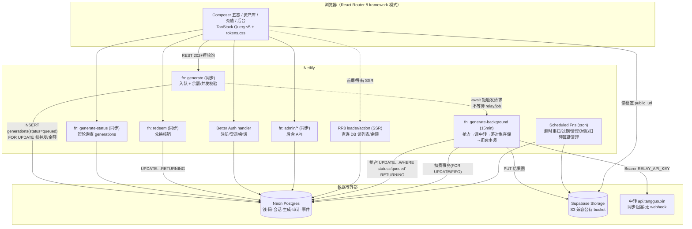
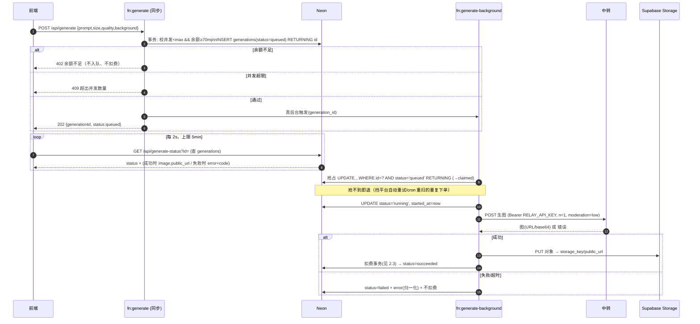
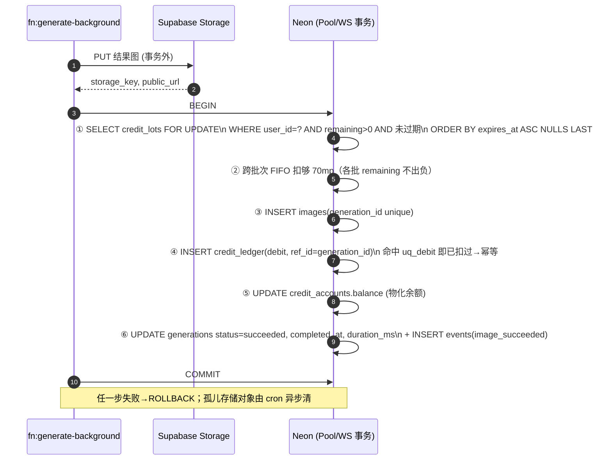
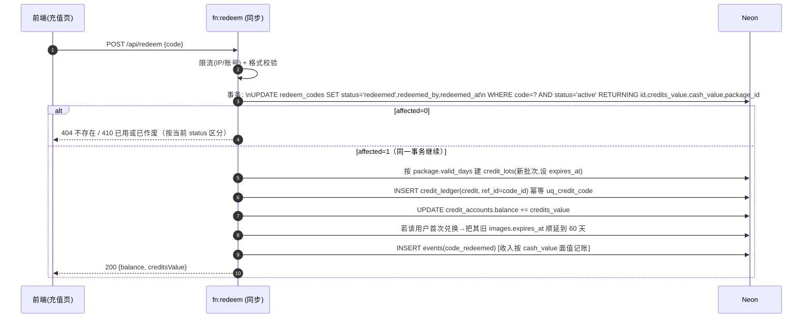
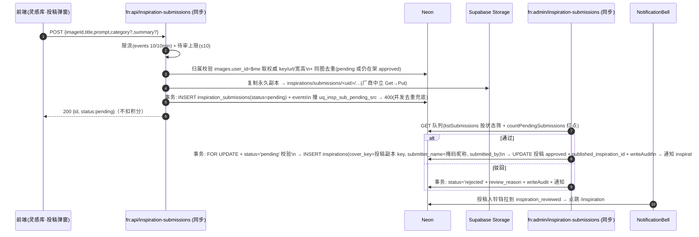
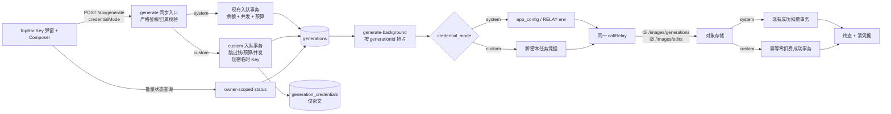

# 2 · 系统架构

> 组件图 + 三大流程时序（生图 / 扣费 / 兑换）。阶段一 = DB-as-queue，第三步规模化才迁独立 worker（[§15 第三步](../redesign-requirements.md)，本期不展开）。
> **2026-07-11 增补**：下方既有图展示 system-only 基线；目标模式化生图架构以 §2.7 为准，两种模式仍共用一个提交端点、一个状态机和一个中转客户端。

## 2.1 组件图

**要点**：
- 前端**只读对象存储的稳定 `public_url`**，永不读中转临时 URL（否则历史/资产库整片裂图）。
- **job 态以 `generations` 表（Postgres）为准**，不再用 Netlify Blobs 存 job 态（Blobs 是 KV、最终一致、无原子操作）。
- 钱/码事务只碰 `credit_lots / credit_ledger / credit_accounts / redeem_codes`；Better Auth 的 `user/session/account/verification` 同库各管各事务、互不干扰。
- **解耦两层轮询**：前端 ↔ 本站 = 短轮询 `generate-status`；本站 ↔ 中转 = Background Function 内**长 await**（中转无 webhook，只能阻塞等）。

## 2.2 流程一 · 生图（提交 → 后台 → 短轮询）

**图中旧 5min 基线**：现有 system-only 代码由前端计时停轮询、cron 收口。目标实现以 `deadline_at` 为权威，状态读取与 cron 共用原子 helper（[03-money.md §4.6](03-money.md) / §2.7）。

## 2.3 流程二 · 扣费（成功落图后的单事务）

> **成功才扣**。判定标准 = **图落对象存储成功 + 写库成功**。先传 Supabase Storage（事务外、结果存临时变量），再开单事务。完整可执行步骤与回滚见 [03-money.md §4.3](03-money.md)；此处给时序骨架。

这把「扣了图没存 / 图存了没扣 / 重复扣 / 余额负」四种错全堵死。幂等键 `uq_debit(ref_id=generation_id, WHERE entry_type='debit')`：平台重试重入到扣费步会撞唯一索引 → 该次扣费被吞、不重复扣。

## 2.4 流程三 · 兑换（单语句原子核销）

单条 `UPDATE…WHERE status='active' RETURNING` 即防"一码多花/并发双击"——只有抢到那一次 `affected=1` 才入账。错误码区分见 [07-api.md §8.4](07-api.md)。

## 2.5 流程四 · 灵感投稿（投稿队列与上架表分离）

> 用户从自己的作品投稿灵感 → 落 `inspiration_submissions`(status=pending) → 后台审核 → 通过即建 `inspirations` 上架卡 + 署名、驳回填原因 → 给投稿人发站内通知。**投稿队列表与上架表 `inspirations` 物理分离**，用户端 `loadInspirations(active=true)` 零改动、永不读到 pending/rejected。**不扣积分**。完整设计/落地见 [INSPIRATION-UGC-PLAN.md](INSPIRATION-UGC-PLAN.md)。

**要点**：
- **owner-scope**：服务端按 `images.user_id=$me` 取权威 `image_key/url/宽高`，绝不信客户端传来的字段。
- **副本前缀以 `inspirations/` 开头** → `deriveCoverKey` 天然接受；通过事务把 `inspirations.cover_key` 设为同一对象、复用不再复制。孤儿清理 known-set 新增 `SELECT image_key FROM inspiration_submissions WHERE status='pending'`：pending 副本受保护、approved 由 `cover_key` 保护、rejected/废弃按孤儿(>1h)回收（[10-ops-test.md](10-ops-test.md)）。
- 后台双守卫（`requireAdminPage` + `requireAdmin`）+ 通过/驳回二次确认 + 审计与状态变更同事务（审计动作 `approve_inspiration_submission` / `reject_inspiration_submission`）。

## 2.6 三步演进（本期只做第一/第二步）

| 步 | 内容 | 本期 |
|---|---|---|
| 第一步 | 修现状隐患：`generate.ts` 真后台 + `imageProxy.ts` 读 env key + 前端 5min 短轮询 | ✅ 阶段一 |
| 第二步 | 上 Neon + Supabase Storage S3 + DB-as-queue + 积分账本/批次 + 兑换码 + 后台 | ✅ 阶段二 |
| 第三步 | 规模化：独立常驻 worker + Redis/BullMQ（或 Netlify Async Workloads / Upstash QStash） | ⬜ 延后 |

> 升级路径**仍在 Netlify 内、不锁平台**：DB-as-queue 撑不住时，把"抢占消费"换成 QStash/Async Workloads 推送即可，`generations` 状态机不变。

## 2.7 模式化生图架构（2026-07-11）

关键边界：

- `generate` 只在严格鉴权、会话/参考图归属和请求契约通过后分流。custom 的 generation 与密文凭据必须同事务创建，或失败时有等价补偿；没有凭据不得返回 202。
- Background 只接 `generationId`，claim 后从 DB 读取 mode/deadline。system 解析全局配置，custom 只解密当前 generation 的 Key；Base URL 始终由服务端决定。
- `callRelay` 继续统一构造、超时、解析与错误脱敏；只有凭据来源不同。失败不跨模式回退。
- 两种模式共享图片、会话、资产、存储和状态表；成功终态按计费事务分流。custom 不触碰任何账户/批次/账本行。
- 每个 generation 在创建时写 5 分钟 `deadline_at`。上游调用最迟 `deadline_at - 30s` 中止，状态读与 cron 均可用状态谓词原子收口超时。
