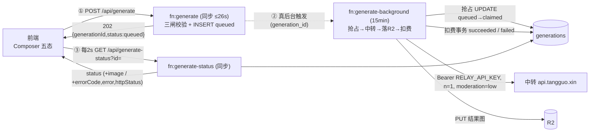

# 5 · 生图管线

> 把生图全链路（**提交 → 真后台消费 → 短轮询**）落成可写代码的工程设计，并落地 **铁律①（单日预算熔断）** 与 **铁律④（修 v1 真后台 + 读 env key）**。
> 规则真相源：规格 [§5](../redesign-requirements.md)（五态）/ [§14](../redesign-requirements.md)（并发与防滥用）/ [§15](../redesign-requirements.md)（演进第一/二步）/ [§22](../redesign-requirements.md)（一致性/超时/预算熔断/失败归一化）。
> 钱/状态机的事务 SQL 不在本章重复，一律链到 [03-money.md](03-money.md)；本章只给**管线编排 + 中转交互 + 熔断 + v1 迁移**。
> 全局约定（mp 整数、状态机、DB 调用模式、密钥红线）见 [README](README.md) 与 [00-overview.md §1.4](00-overview.md)。

---

## 5.1 管线总览

端到端三段，**解耦两层等待**：前端 ↔ 本站走**短轮询**（每 2s，上限 5min）；本站 ↔ 中转走 Background Function 内**长 await**（中转同步阻塞、无 webhook，只能阻塞等）。job 态以 **`generations` 表（Postgres）为权威**，不再用 Netlify Blobs（KV、最终一致、无原子操作）。完整时序见 [01-architecture.md §2.2](01-architecture.md)。



| 段 | 函数 | 类型 | 职责 | 链接 |
|---|---|---|---|---|
| 提交入队 | `generate` | 同步（≤26s） | 三闸校验 → 建会话 → `INSERT generations(queued)` → 触发真后台 → 返回 202 | §5.2 |
| 后台消费 | `generate-background` | **Background（15min）** | 抢占 → 调中转 → 落 R2 → 扣费 → 终态 | §5.3 |
| 状态查询 | `generate-status` | 同步 | 查 `generations` 返回 status (+image / +errorCode,error,httpStatus) | §5.4 |

**铁律映射**：抢占式状态机（铁律③）落 §5.3 + [03-money.md §4.5](03-money.md)；单日预算熔断（铁律①）落 §5.6；真后台 + 读 env key（铁律④）落 §5.7。

---

## 5.2 提交入队（`generate` 同步函数）

职责：**轻、快、只校验+入队**，不碰中转、不阻塞。重活全甩给后台。

**函数签名 / 流程**：

```ts
// netlify/functions/generate.ts （v2 重写，见 §5.7 迁移）
import { z } from 'zod';
import { generateInputSchema } from '../../src/contracts/generate';   // 07 §8.5
import { requireSession } from '../../src/server/auth';                // 05 §6.3
import { withTxn } from '../../src/server/db';                         // Pool/WS 事务
import { enqueueGeneration } from '../../src/server/generation/enqueue';

export async function handler(event) {
  if (event.httpMethod !== 'POST') return json(405, { error: 'method_not_allowed' });
  const user = await requireSession(event);                            // 401 未登录 / 403 封禁（硬校验）
  const input = generateInputSchema.parse(JSON.parse(event.body ?? '{}')); // {prompt,size,quality,background,conversationId?}

  // 三闸（余额/并发/预算）+ 建会话 + INSERT generations(queued) 全在一个事务里
  const { generationId } = await enqueueGeneration({ user, input });   // 抛 402/409/429

  await triggerBackground(generationId);                               // 真后台触发（§5.7）
  return json(202, { generationId, status: 'queued' });
}
```

**三闸（入队前，单事务）**——完整 SQL 见 [03-money.md §4.9](03-money.md)，此处只点职责与失败码：

| 闸 | 判定 | 失败 | 说明 |
|---|---|---|---|
| 并发闸 | `COUNT(status IN queued/claimed/running) < users.max_concurrency` | `409 超出并发数量` | COUNT 为准、无独立计数器 |
| 余额闸 | `SUM(可用批次 remaining_mp) ≥ PRICE_MP(70)` | `402 积分不足，去充值` | **只判不扣**（成功才扣）；不足直接报错、不入队、不扣费 |
| 预算闸 | `!isDailyBudgetExhausted(c)`（铁律①，§5.6；**入队前·事务内**用同一 client `c` 读当日 key） | `429 今日额度已满，请稍后` | 省 compute 的第一道闸 |

**入队动作**（三闸通过、同事务内）：
1. 会话（conversation）：若 `input.conversationId` 缺省则 `INSERT conversations(...) RETURNING id`（对话式每轮挂在会话下，表见 [02-database.md §3.2](02-database.md)）。
2. `INSERT generations(id, user_id, conversation_id, model='gpt-image-2', prompt, size, quality, background, moderation='low', status='queued') RETURNING id`。
3. COMMIT 后返回 `202 {generationId, status:'queued'}`。

> ⚠️ `INSERT generations` 与三闸**同一事务**（`FOR UPDATE` 串行化），杜绝"并发两次提交都读到余额够"的双花。`generationId` 即贯穿全链路的幂等主键。

**触发真后台**：见 §5.7「触发方式迁移」——v2 不再用 `fetch` 主动调，靠 **`-background` 后缀**让 Netlify 异步派发（拿回 15min + 平台重试）。

---

## 5.3 后台消费（`generate-background`，抢占式）

`-background` 后缀 = Netlify 识别为 Background Function（15min、异步、平台会自动重试）。**正因平台会重试**，入口必须**抢占式状态机**挡重复下单/重复扣费（铁律③）。

**主流程伪代码骨架**：

```ts
// netlify/functions/generate-background.ts （v2 重写）
import { httpSql } from '../../src/server/db';            // neon() HTTP，单语句原子
import { callRelay } from '../../src/server/relay';       // 见下；读 env key
import { putToR2 } from '../../src/server/storage';       // 06 §7.3
import { chargeOnSuccess } from '../../src/server/money';  // 03 §4.3 扣费事务
import { budget } from '../../src/server/budget';         // §5.6
import { normalizeFailure } from '../../src/server/generation/failure'; // §5.8

export async function handler(event) {
  const { generationId } = JSON.parse(event.body ?? '{}');

  // ① 抢占（铁律③）：单语句 UPDATE…WHERE status='queued' RETURNING（HTTP 即原子）
  const claimed = await httpSql/*sql*/`
    UPDATE generations SET status='claimed', job_id=${workerTag()}, updated_at=now()
    WHERE id=${generationId} AND status='queued' RETURNING id, user_id, prompt, size, quality, background, input_image_key`;
  if (claimed.length === 0) return;                       // 抢不到（重试/重扫/已终态）→ 立即退，不调中转、不扣费

  const g = claimed[0];
  // ② 置 running + 记开始时间（cron 5min 超时以 COALESCE(started_at, updated_at) 为准，§5.5）
  await httpSql/*sql*/`UPDATE generations SET status='running', started_at=now() WHERE id=${generationId} AND status='claimed'`;

  // ③ 预算硬上限（铁律①·防破产）：与「递增 calls」同一条原子语句、调中转「前」执行（§5.6）。
  //    affected=0 → 当日额度已满 → 不调中转、置 failed(insufficient_quota)、不扣费、立即退。
  const ok = await budget.incCallIfUnderCap();
  if (!ok) {
    await httpSql/*sql*/`
      UPDATE generations SET status='failed', error_code='insufficient_quota', error='今日额度已满，请稍后',
        completed_at=now(), duration_ms=(EXTRACT(EPOCH FROM now()-started_at)*1000)::int, updated_at=now()
      WHERE id=${generationId} AND status='running'`;
    return;                                                // 不进扣费事务 → 天然未扣
  }
  const t0 = Date.now();
  try {
    // ④ 调中转（Bearer 从 process.env.RELAY_API_KEY；n=1；moderation=low）
    //    ★ 图生图(i2i)分支：有 input_image_key → 先回读参考图字节（getUploadObject），失败即友好 invalid_request（不扣费，§5.9）；
    //      callRelay 见到 inputImage 即走 /images/edits multipart（buildEditsForm），否则走 /images/generations JSON。
    let inputImage: { bytes: Uint8Array; contentType: string } | undefined;
    if (g.input_image_key) {
      try { inputImage = await getUploadObject(g.input_image_key); }   // 06 §7.x；回读字节 + content-type
      catch (e: any) { const err: any = new Error('参考图读取失败，请重试'); err.httpStatus = 400; err.code = 'invalid_request'; throw err; }
    }
    const { images, raw } = await callRelay({ prompt: g.prompt, size: g.size, quality: g.quality, background: g.background, inputImage });

    // ⑤ 落 R2（事务外，结果存临时变量）→ 06 §7.3
    //    putToR2 内部自取字节（url→下载 或 b64_json→decode，复用 imageGeneration.ts 解析，§5.7），返回 {storageKey,publicUrl,contentType,width,height,sizeBytes}
    const obj = await putToR2(g.user_id, generationId, images[0]);

    // ⑥ 扣费事务（成功才扣，FIFO + uq_debit 幂等）→ 03 §4.3；内部置 status='succeeded'。
    //    ★ 入口先做 03 §4.3⓪ 双守卫（锁 generation 行断言 running + 探 debit 幂等）；duration_ms 在库内用
    //      (EXTRACT(EPOCH FROM now()-started_at)*1000)::int 整段毫秒（F-dur，禁 EXTRACT(MILLISECONDS …)），应用层不传 t0。
    await chargeOnSuccess({ generationId, userId: g.user_id, ...obj });
  } catch (err) {
    // ⑦ 失败/超时：归一化后写 failed，不扣费（脱敏后才落库回前端）
    //    duration_ms 一律在库内用 (EXTRACT(EPOCH FROM now()-started_at)*1000)::int 整段毫秒（F-dur；
    //    禁用 EXTRACT(MILLISECONDS …)——PG 陷阱：只返秒字段×1000、≥1min 被截断）。与 03 §4.3 成功路径同口径。
    const { code, message } = normalizeFailure(err);     // §5.8
    await httpSql/*sql*/`
      UPDATE generations SET status='failed', error_code=${code}, error=${message},
        http_status=${err.httpStatus ?? null}, completed_at=now(),
        duration_ms=(EXTRACT(EPOCH FROM now()-started_at)*1000)::int, updated_at=now()
      WHERE id=${generationId} AND status='running'`;
  } finally {
    // ⑧ 调中转后 HTTP upsert 累计墙钟 ms（仅监控/告警、不硬挡）；被平台杀导致少计
    //    → 由 §11.8 cron 用当日 generations.duration_ms 之和重算覆盖 ms 键（§5.6）。
    await budget.incMs(Date.now() - t0);
    // ★ [gen-timing] 拆分耗时日志（fetchInput/relay/putToR2/total，单位 ms）便于定位 i2i 跨境慢点（commit f6842c1）。
    console.log('[gen-timing]', { generationId, fetchInputMs, relayMs, putR2Ms, totalMs: Date.now() - t0 });
  }
}
```

**中转调用封装**（铁律④：Key 只在此处从 env 注入）：

```ts
// src/server/relay.ts
import { buildImageGenerationUrl, buildImageGenerationPayload, parseImageGenerationResponse } from '../api/imageGeneration';
import { redactText } from '../lib/redaction';
import { httpSql } from './db';

const RELAY_SOFT_TIMEOUT_MS = 4.5 * 60_000;             // 略小于 cron 5min，本函数自归一化 provider_timeout（F-relay）

// 主/备 Base：主取 app_config.relay_base_url，备取 env；主失败/超时退避重试一次到备用
async function relayBases(): Promise<string[]> {
  const rows = await httpSql/*sql*/`SELECT value_json->>'relay_base_url' AS base FROM app_config WHERE key='relay_base_url'`;
  const primary = rows[0]?.base || process.env.RELAY_BASE_URL!;
  const backup  = process.env.RELAY_BASE_URL_BACKUP;    // 可空；无备用则只试主
  return backup && backup !== primary ? [primary, backup] : [primary];
}

export async function callRelay(req: { prompt: string; size: string; quality: string; background: string; inputImage?: { bytes: Uint8Array; contentType: string } }) {
  const key   = process.env.RELAY_API_KEY!;             // ★ 只在 Background Function 注入
  const bases = await relayBases();
  // ★ 端点二分：有 inputImage → /images/edits（multipart，buildEditsForm，图生图 i2i）；否则 → /images/generations（JSON，文生图）。
  const isEdit = !!req.inputImage;
  const { path, body, headers } = isEdit
    // edits multipart：buildEditsForm 塞 image（参考图字节 + contentType）/prompt/size/n=1；返回 {path:'edits', body:FormData, headers:{}}。
    // ★★ 强制 response_format='b64_json'（关键性能项，见下「i2i 关键性能项」）让中转「内联回 b64」、不回临时 url。
    ? buildEditsForm({ model: 'gpt-image-2', prompt: req.prompt, size: req.size, n: 1, response_format: 'b64_json', image: req.inputImage })
    : { path: 'generations', body: JSON.stringify(buildImageGenerationPayload({
        model: 'gpt-image-2', prompt: req.prompt, size: req.size, quality: req.quality,
        background: req.background, moderation: 'low', n: 1,             // ★ 固定 n=1 / moderation=low
      })), headers: { 'Content-Type': 'application/json' } };
  // edits 走 multipart：FormData 自带 boundary，不手设 Content-Type；endpoint = images/edits vs images/generations。

  let lastErr: any;
  for (let i = 0; i < bases.length; i++) {
    const base = bases[i];
    const ctrl = new AbortController();
    const timer = setTimeout(() => ctrl.abort(), RELAY_SOFT_TIMEOUT_MS);   // 软超时 → AbortError → provider_timeout
    try {
      const resp = await fetch(`${base}/v1/images/${path}`, {            // edits=multipart / generations=JSON，端点由上 path 决定
        method: 'POST', signal: ctrl.signal,
        headers: { Authorization: `Bearer ${key}`, ...headers },         // multipart 时不带 Content-Type，由 FormData 自带 boundary
        body,
      });
      if (!resp.ok) {
        const detail = redactText(await resp.text(), [key]);              // ★ 脱敏后才外传（§5.8）
        const e: any = new Error(detail); e.httpStatus = resp.status; throw e;
      }
      const raw = await resp.json();
      // ★ F-429：One-API 偶有 HTTP200+error。resp.ok 后先探 2xx body 的 error 对象；
      //   缺正常字段（data/output）则当上游错误抛出走归一化，避免把错误体当成功 putToR2。
      if (raw?.error && !raw?.data && !raw?.output) {
        const detail = redactText(JSON.stringify(raw.error), [key]);
        const e: any = new Error(detail); e.httpStatus = raw.error?.status ?? 200; throw e;
      }
      return { images: parseImageGenerationResponse(raw), raw };
    } catch (err: any) {
      lastErr = err;
      // ★ 重试只对「连不上/网络错/5xx」，不对已发出的请求重投（中转无幂等键、避免重复下单）。
      const status = err?.httpStatus as number | undefined;
      const retriable = err?.name === 'AbortError'
        || err?.name === 'TypeError' || /fetch failed|ECONN|network/i.test(String(err?.message ?? ''))
        || (status !== undefined && status >= 500);
      // AbortError（软超时）= 请求已发出、不知中转是否在跑 → 不退避重试（防重复下单），直接抛走 provider_timeout
      if (err?.name === 'AbortError' || !retriable || i === bases.length - 1) throw err;
      await new Promise((r) => setTimeout(r, 500 + i * 500));              // 退避后退到备用 Base 重试一次
    } finally {
      clearTimeout(timer);
    }
  }
  throw lastErr;
}
```

**要点**：
- 抢占用 **HTTP 单语句**（`UPDATE…RETURNING` 即原子，不需事务），扣费用 **Pool/WS 事务**（[03-money.md §4.3](03-money.md)）——两种 DB 调用模式各司其职（[00-overview.md §1.3](00-overview.md)）。
- **失败/超时路径从不进扣费事务**，所以天然"未扣"；前端失败卡注明"未扣积分"（§5.4）。
- 落 R2 在扣费事务**外**：先传图存临时变量，再开单事务扣费；ROLLBACK 留下的孤儿 R2 对象由清理 cron 扫（[06-storage.md §7.5](06-storage.md)）。

### 5.3.1 图生图（i2i）管线分支

文生图与图生图共用同一 `generate-background` 主流程，**唯一分叉在调中转前**：`claimed` 回读到 `input_image_key` 非空 → 进入 i2i 分支（步骤④ 上半）。

- **参考图回读**：i2i 先 `getUploadObject(input_image_key)`（[06-storage.md §7.x](06-storage.md)）从 R2 取参考图字节 + content-type。**回读失败即归一化为友好 `invalid_request`（HTTP 400「参考图读取失败，请重试」）→ 不调中转、不扣费**（走 §5.3 步骤⑦失败路径，天然未扣）。参考图本身「用后即弃」、靠孤儿 cron 回收（入队链路 = `POST /api/uploads` → `uploads/<userId>/…` → `GenerateRequest.inputImageKey` → `generations.input_image_key`，迁移 0003）。
- **端点与编码**：`callRelay` 见 `inputImage` 即走 `/v1/images/edits` **multipart**（`buildEditsForm` 塞 image/prompt/size/n=1）；文生图仍走 `/v1/images/generations` JSON。multipart 由 `FormData` 自带 boundary、不手设 `Content-Type`。
- **★★ 关键性能项：`response_format='b64_json'`**（commit `0378d67`）。中转 `/images/edits` **默认回美西 aliyuncs 临时 url**，`putToR2` 拿到 url 还要**二次跨境下载**该临时图，慢到数分钟（曾超 5min 前端轮询窗 → 图其实已成功入库、但 UI 看不到、被软超时误判失败）。强制 `b64_json` 让中转**内联回 base64**，`putToR2` 直接 decode 落库、免去这趟跨境下载，是把 i2i 拉回 5min 窗内的**性能必需项、非可选优化**。
- **耗时可观测**：管线加 `[gen-timing]` 拆分日志（`fetchInput / relay / putToR2 / total` 毫秒，commit `f6842c1`），专为定位 i2i 跨境慢点。
- **不变项**：抢占式状态机（铁律③）、成功才扣（铁律②口径）、双守卫（[03-money.md §4.3⓪](03-money.md)）、5min 双层超时（§5.5）i2i 与文生图**完全一致**，无特例。

---

## 5.4 短轮询（`generate-status` 同步函数）

前端每 **2s** 轮询、上限 **5min**；查 `generations` 返回当前 status。响应是**按 status 的判别联合**（discriminated union on status，Zod4 `z.discriminatedUnion`，契约见 [07-api.md §8.3](07-api.md) / §8.5，逐字段与此处一致）：进行中带 `startedAt?/elapsedMs?`、成功带 `image{publicUrl,width,height}+creditsChargedMp+durationMs`、失败带 `errorCode+error+httpStatus`。

```ts
// netlify/functions/generate-status.ts （v2 重写）
export async function handler(event) {
  if (event.httpMethod !== 'GET') return json(405, { error: 'method_not_allowed' });
  const user = await requireSession(event);
  const id = event.queryStringParameters?.id;
  if (!id) return json(400, { error: 'missing_id' });

  const rows = await httpSql/*sql*/`
    SELECT g.status, g.error_code, g.error, g.http_status, g.duration_ms,
           g.started_at, g.credits_charged_mp,
           i.public_url, i.width, i.height
    FROM generations g LEFT JOIN images i ON i.generation_id = g.id
    WHERE g.id=${id} AND g.user_id=${user.id}`;          // ★ 限本人，防越权查别人 job
  if (rows.length === 0) return json(404, { error: 'not_found' });

  const g = rows[0];
  switch (g.status) {
    case 'queued': case 'claimed': case 'running':       // 进行中（不含 creditsChargedMp）
      return json(200, {
        status: g.status,
        startedAt: g.started_at ?? undefined,
        elapsedMs: g.started_at ? Date.now() - new Date(g.started_at).getTime() : undefined,
      });
    case 'succeeded':
      return json(200, {
        status: 'succeeded',
        image: { publicUrl: g.public_url, width: g.width, height: g.height },
        creditsChargedMp: g.credits_charged_mp,
        durationMs: g.duration_ms,
      });
    case 'failed':
      return json(200, {
        status: 'failed', errorCode: g.error_code, error: g.error, httpStatus: g.http_status ?? null,
      });
  }
}
```

**前端轮询规则**（详见 [08-frontend.md §9.3](08-frontend.md) / §9.4）：
- TanStack Query `refetchInterval`：进行中态 2000ms，终态停轮询。
- **5min 软超时**：自轮询起计满 5min 仍无终态（status 仍 queued/claimed/running）→ 前端**软判失败、释放 UI**（停轮询、显失败卡、注明"未扣积分"）。这是 UI 层不让用户干等，**权威判定在服务端 cron**（§5.5）。
- **生成中不可取消**：无取消按钮、无"已取消"态（规格 §5.3）。

---

## 5.5 5min 超时（前端软超时 vs 服务端权威 cron）

两层超时，**职责不同、不重复**：

| 层 | 触发 | 作用 | 是否改库 |
|---|---|---|---|
| 前端软超时 | 轮询满 5min 无终态 | 释放 UI、显失败卡 | 否（纯 UI） |
| **服务端权威 cron** | `status IN(claimed,running) AND COALESCE(started_at, updated_at) < now()-5min`；**并覆盖超龄 `queued`**（触发 fetch 失败成孤儿的行）：`status='queued' AND updated_at < now()-5min` | 把僵死/孤儿任务置 `failed/provider_timeout`，**权威释放并发** | 是 |

> **触发失败不成永久孤儿**：§5.7 真后台触发是 fire-and-forget，触发 fetch 偶发失败时 generations 行已 `queued`、202 已返回。两道兜底保证它最终被消费或收尾：① 常驻 **Scheduled Function** 每分钟扫 `queued` 派发（§5.5 末「派发兜底」，已从"不作主路径"升为常驻兜底）；② 上面超时 cron 把超龄 `queued`（绝非短暂在途、而是 >5min 仍没人抢）一并置 `failed/provider_timeout`，释放并发。

- **僵尸 `claimed` 兜底**：后台抢占（`status='claimed'`）后、尚未执行步骤②写 `started_at` 之前若被平台杀掉，`started_at` 仍为 NULL，单看它会永远扫不到 → 超时重扫一律用 **`COALESCE(started_at, updated_at)`**（抢占即 `updated_at=now()`，故必有值），保证「claimed 但未写 started_at 即被杀」的行也能被收尾。判定 SQL 与此完全一致，见 [03-money.md §4.6](03-money.md) / [10-ops-test.md §11.6](10-ops-test.md)。
- **释放并发 = 状态进终态**：并发口径 = `COUNT(status IN queued/claimed/running)`，行一旦置 `failed/succeeded` 即自动移出 COUNT，**无双减/漏减**（规格 §22）。
- 为什么需要服务端兜底：前端可能关页/断网，软超时不会触发；后台函数也可能被平台杀在 5min 后——只有 cron 能权威收尾、避免并发被僵死任务永久占满。
- **派发兜底（常驻、非临时）**：一个 **Scheduled Function** 每分钟扫 `status='queued'` 的行、对其调真后台触发（与 §5.7 同一 fire-and-forget 触发，抢占式状态机 §5.3 保证重发不重复下单）。这道兜底从过去的"不作主路径"**升为常驻兜底**：主路径仍是 §5.2 入队后立即触发，但触发 fetch 失败时由它补派发，杜绝 `queued` 永久无人消费。部署见 [10-ops-test.md §11.6](10-ops-test.md)。

---

## 5.6 单日预算熔断（铁律①）

> **背景**：Netlify **无全局消费帽**；中转**同步阻塞**，后台函数按**墙钟**烧 compute（GB-hour），平台自动重试还会放大。这是**防站长破产的唯一硬上限**（规格 §14/§22）。子 Key 不做（一把共享 Key），故应用层熔断是唯一防线。

**两道闸（软硬分离，防破产硬上限是后者）**：

| 闸 | 时机 | env 阈值 | 作用 / 语义 |
|---|---|---|---|
| **软闸**（快速预拦） | 入队前·三闸事务内（§5.2 / [03-money.md §4.9](03-money.md)） | `DAILY_RELAY_BUDGET_CALLS` | 读当日 key（可能偏旧）只作快速预拦、省 compute；**不是**最终防线 |
| **硬上限**（防破产） | Background Function 抢占成功、**调中转前**（§5.3 步骤③） | `DAILY_RELAY_BUDGET_CALLS` | 与「递增 calls」**同一条原子条件 UPDATE**；越界即拒、绝不调中转 |
| ms（仅监控） | 调中转**后** finally（§5.3 步骤⑧） | `DAILY_RELAY_BUDGET_MS` | HTTP upsert `ms += duration_ms`；**仅监控/告警、不硬挡** |

计数行 **key = `relay_budget:${YYYY-MM-DD}`**（日期拼进 key，按服务端约定时区 **Asia/Shanghai** 取当日），`value_json` jsonb = `{ "calls": int, "ms": int }`。字段名统一 **`calls` / `ms`**（不是 compute_ms）。

```sql
-- ① 软闸（入队，读=快速预拦，偏旧无妨）：见 src/server/budget.ts isDailyBudgetExhausted（事务内同 client c 读）

-- ② 硬上限（调中转前·防破产）：先保证今日行存在，再用「带阈值条件的原子自增」做唯一裁决。
--    INSERT…ON CONFLICT DO NOTHING 保证今日 key 行存在
INSERT INTO app_config(key, value_json) VALUES (${'relay_budget:'||today}, '{"calls":0,"ms":0}')
  ON CONFLICT (key) DO NOTHING;
--    带阈值的条件自增：仅当当日 calls < 上限才 +1 并 RETURNING；affected=0 ⇒ 越界（不调中转）
UPDATE app_config
SET value_json = jsonb_set(value_json, '{calls}', to_jsonb((value_json->>'calls')::bigint + 1))
WHERE key = ${'relay_budget:'||today}
  AND (value_json->>'calls')::bigint < ${'$DAILY_RELAY_BUDGET_CALLS'}
RETURNING value_json;

-- ③ ms 累计（调中转后，仅监控/告警）：HTTP 单语句 jsonb 原子加
UPDATE app_config
SET value_json = jsonb_set(value_json, '{ms}', to_jsonb((value_json->>'ms')::bigint + ${elapsedMs}))
WHERE key = ${'relay_budget:'||today};
```

> 为何「硬上限必须是带阈值条件的 RETURNING 自增、而非先读后写」：先读后写有 TOCTOU 竞态、并发请求会一起越界；把「判 + 增」压成同一条 `UPDATE…WHERE calls<上限 RETURNING` 才原子。软闸只读、允许偏旧，目的是省 compute 不是兜底。

> **最坏溢出量化**：calls 硬上限的过冲 ≈「已过软闸、尚未走到 `incCallIfUnderCap` 的在途请求数」，受全站瞬时并发封顶（每用户并发 × 用户数上限）；据此给 `DAILY_RELAY_BUDGET_CALLS` 留安全余量即可，不会无界破产。

> 备选：对 `events` 当日聚合（`type='image_*'` 计 calls、`duration_ms` 求和）。优点免维护计数行、缺点每次入队都要扫聚合，规模大时慢。**阶段一用计数行**（O(1) 读写），看板从 `events` 算精确值对账即可。

**检查点分工**：软闸读在 [03-money.md §4.9](03-money.md) 三闸事务里**用同一 Pool/WS client `c`**（不另起 `httpSql`）；硬上限自增在 Background Function 内走 HTTP（条件 UPDATE，非钱事务）；ms 累计同走 HTTP。

```ts
// src/server/budget.ts
function todayKey() { return `relay_budget:${shanghaiDate()}`; }   // Asia/Shanghai 当日 YYYY-MM-DD

// 软闸：接收三闸事务的 client c，用 c.query 读当日 key（事务内·可偏旧·只快速预拦）
export async function isDailyBudgetExhausted(c: PoolClient): Promise<boolean> {
  const { rows: [row] } = await c.query('SELECT value_json FROM app_config WHERE key=$1', [todayKey()]);
  if (!row) return false;
  const { calls = 0, ms = 0 } = row.value_json;
  return calls >= +process.env.DAILY_RELAY_BUDGET_CALLS! || ms >= +process.env.DAILY_RELAY_BUDGET_MS!;
}
// generate 入队事务内：if (await isDailyBudgetExhausted(c)) throw httpError(429, '今日额度已满，请稍后');

export const budget = {
  // 硬上限：先 INSERT…ON CONFLICT DO NOTHING 保证今日行存在，再带阈值条件自增 calls；
  //   RETURNING 有行 ⇒ true（已占额、可调中转）；affected=0 ⇒ false（越界、拒调中转，调用方置 failed/insufficient_quota）。
  async incCallIfUnderCap(): Promise<boolean> {
    await httpSql/*sql*/`INSERT INTO app_config(key,value_json) VALUES (${todayKey()},'{"calls":0,"ms":0}') ON CONFLICT (key) DO NOTHING`;
    const rows = await httpSql/*sql*/`
      UPDATE app_config SET value_json = jsonb_set(value_json,'{calls}', to_jsonb((value_json->>'calls')::bigint + 1))
      WHERE key=${todayKey()} AND (value_json->>'calls')::bigint < ${+process.env.DAILY_RELAY_BUDGET_CALLS!}
      RETURNING value_json`;
    return rows.length > 0;
  },
  // ms 累计：仅监控/告警，不硬挡；被平台杀少计 → §11.8 cron 用当日 generations.duration_ms 之和重算覆盖
  async incMs(ms: number) { /* jsonb_set ms += ms（HTTP 单语句，调中转后 finally）*/ },
};
```

- **超限返回**：软闸命中拦在生成入口 `429 今日额度已满，请稍后`（不入队、不烧 compute）；硬上限命中在后台置该 generation `failed`（`error_code=insufficient_quota`、`error=今日额度已满，请稍后`、不扣费，§5.3 步骤③）。
- **ms 自愈**：incMs 仅监控；被平台杀导致少计的 ms 由 [10-ops-test.md §11.8](10-ops-test.md) 每日 cron 用当日 `generations.duration_ms` 之和**重算覆盖** ms 键，保证看板/告警口径准确。
- **每日重置**：靠 key 拼日期天然滚动（跨天即新 key 从 0 起，无需 upsert 固定行清零）；旧日期键由每日重置 cron 降级为「清理/归档旧键 + 近阈告警」（[10-ops-test.md §11.8](10-ops-test.md)）。
- **告警**：接近阈值（如 ≥80%）或触发熔断时打 `ADMIN_ALERT_WEBHOOK`（[10-ops-test.md §11.9](10-ops-test.md)）。
- 与铁律②配套：上线前实测单图 GB-hour 成本对账 0.07 定价（[10-ops-test.md §11.5](10-ops-test.md)），据此设 `DAILY_RELAY_BUDGET_MS`。

---

## 5.7 v1 代码迁移（铁律④）

对照已读到的 v1 现状逐点给改法。核心三宗罪：**假后台（会超时）**、**Key 走请求体（泄露）**、**job 态走 Blobs（KV 最终一致、无原子）**。

### 现状 → 目标 迁移点表

| # | v1 现状（文件） | 问题 | v2 目标 |
|---|---|---|---|
| 1 | `generate.ts` 用 `fetch(${baseUrl}/.netlify/functions/generate-background)` 主动调 | **非真 Background**：发起方是同步函数，10/26s 会被生图打超时；丢平台 15min + 重试 | 删 `triggerBackgroundJob` 的 fetch；靠 **`-background` 后缀**让 Netlify 异步派发（见下「触发方式」） |
| 2 | `imageProxy.ts` 从 `input.apiKey`（请求体）取 Key | **Key 经前端/请求体流转**，违反密钥红线 | 删 `apiKey` 入参；`callRelay` 内从 `process.env.RELAY_API_KEY` 注入（§5.3）；全链路删 apiKey 字段、密钥 UI、localStorage（[00-overview.md §1.4](00-overview.md) / 规格 §18） |
| 3 | `imageProxy.ts` 在**同步函数**内 `await fetch(中转)` | 阻塞调用在 10/26s 函数里跑 5min 生图 | 把阻塞 fetch **搬进 Background Function**（`generate-background.ts` 的 `callRelay`） |
| 4 | `jobStore.ts`（Netlify Blobs `getStore`）+ `asyncImageJob.ts` 的 `JobRecord` | Blobs 是 **KV、最终一致、无原子操作**；抢占式状态机要靠 DB 行锁/RETURNING | job 态迁 **`generations` 表**；删 `jobStore.ts`/Blobs；`JobRecord` 字段映射见下 |
| 5 | `asyncImageJob.ts` 状态 `pending/running/succeeded/failed` | 缺 `queued/claimed`、无抢占语义 | 改用 `generations.status ∈ {queued,claimed,running,succeeded,failed}`（README 全局约定）；抢占 §5.3 |
| 6 | `generate-status.ts` 查 Blobs、返回整包 `response` | 无鉴权、返回原始中转响应 | 查 `generations`+`images`、限本人、按 status 判别联合只回 `status (+image / +errorCode,error,httpStatus)`（§5.4） |
| 7 | `generate-background.ts` 直接 `runImageJob`、无抢占 | 平台重试会重复下单/重复扣费 | 入口先抢占 `UPDATE…WHERE status='queued' RETURNING`（§5.3 / [03-money.md §4.5](03-money.md)） |

### 触发方式迁移（罪 1 修法）

```ts
// v1（错）：同步函数主动 fetch 后台 —— 删掉
await fetch(`${baseUrl}/.netlify/functions/generate-background`, { method:'POST', body: ... });

// v2（对）：Netlify 对 -background 后缀函数提供异步触发。两种合规姿势：
//   A. @netlify/functions v2 的同步/后台分离：generate.ts INSERT 后，由 generate-background.ts 自身被平台异步拉起。
//      最简：仍发一个到 /.netlify/functions/generate-background 的请求，但目标是 *-background 函数 ——
//      Netlify 见 -background 后缀即「立即 202、后台跑满 15min」，发起方不阻塞、不等结果。
//   B. （阶段一 DB-as-queue）由 Scheduled Function 每分钟扫 queued 派发 —— **常驻兜底**（§5.5），不只是主路径的临时替补。
async function triggerBackground(generationId: string) {
  // 本地 netlify dev 下 URL/DEPLOY_PRIME_URL 可能缺失 → 显式回退到本地、缺失则断言报错（F-trigger）
  const base = process.env.URL || process.env.DEPLOY_PRIME_URL
    || (process.env.NETLIFY_DEV ? 'http://localhost:8888' : undefined);
  if (!base) throw new Error('triggerBackground: 缺少 URL/DEPLOY_PRIME_URL（生产环境必有，本地请用 netlify dev）');
  // 关键差异：目标是 *-background 函数；Netlify 立即返回、后台独立跑（拿回 15min + 平台重试）。
  // ★ fire-and-forget：触发 fetch 不 await、错误吞掉（行已 queued、202 已返回）；
  //   触发失败由 §5.5 常驻 Scheduled 派发 + 超时 cron 扫超龄 queued 兜底，绝不成永久孤儿。
  void fetch(`${base}/.netlify/functions/generate-background`, {
    method: 'POST', headers: { 'Content-Type': 'application/json' },
    body: JSON.stringify({ generationId }),                 // ★ 只传 generationId，不传任何 Key/input 明细
  }).catch((e) => { /* 仅记日志、不抛：触发失败不影响已 202，兜底见 §5.5 */ console.error('triggerBackground failed', e); });
}
```

> 与 v1 的本质区别：v1 发起方**等 await 那个调用完成**（同步函数里阻塞），目标函数无 `-background` 后缀按同步跑、超时；v2 目标函数是 `-background`，Netlify 见后缀即「即刻 202、后台异步跑满 15min」，发起方不被 5min 生图拖死。**抢占式状态机（§5.3）配合平台重试**，即便触发重发也不会重复下单。

### 可复用的 v1 资产（保留、别重写）

| 文件 | 复用点 |
|---|---|
| `src/api/imageGeneration.ts` | `buildImageGenerationUrl` / `buildImageGenerationPayload` / **`parseImageGenerationResponse`**（兼容 `data[]`/`output[]`、url/b64_json，照旧解析中转响应；图生图回 b64_json 即走此处 b64 分支） |
| `buildEditsForm`（i2i） | 图生图组装 `/images/edits` multipart `FormData`（image 字节 + prompt/size/n=1 + **`response_format='b64_json'`**，§5.3.1）；返回 `{path:'edits', body, headers}` 供 `callRelay` 复用 |
| `src/lib/redaction.ts` | `redactText` / `redactSecrets`——回前端/落库前脱敏 Key（§5.8、§5.3 的 `callRelay`） |

### 可删除的 v1 资产

`netlify/functions/`：保留 `generate.ts`/`generate-background.ts`/`generate-status.ts` 三文件名（重写内部）。**删** `src/server/jobStore.ts`、`src/server/imageProxy.ts`（逻辑搬进 `src/server/relay.ts`）、`src/server/asyncImageJob.ts` 的 `JobRecord`/Blobs 依赖；前端删 `apiKey` 字段、密钥输入 UI、`localStorage` 中 Key 的读写。完整清单见 [11-structure-roadmap.md §12.2](11-structure-roadmap.md)。

---

## 5.8 失败原因归一化

中转**原始文案 / HTTP 状态** → **有限枚举**，便于看板「失败原因 Top」统计（规格 §9 看板②）与后台生成记录列表直显（[09-admin.md §10.5](09-admin.md)）。**脱敏后才回前端 / 落库**。

> 本节是 `error_code` 归一化枚举的**唯一权威源**（全文档其它章一律引此）。六值：`insufficient_quota | relay_5xx | provider_timeout | content_rejected | relay_unreachable | unknown`。
> ⚠️ **澄清**：`insufficient_quota` = **中转/上游**的配额或额度不足（共享 Key 烧光、上游欠费等），**不是用户积分不足**——用户积分不足在入队前即由余额闸 `402` 拦截（§5.2）、根本不入队，永远走不到这里。

**枚举与映射表**：

| `error_code` | 触发条件（中转返回） | 前端文案 | 后台列表显示 |
|---|---|---|---|
| `insufficient_quota` | 中转返回额度/欠费类（如 `insufficient_quota`、402/429 含 quota 文案） | 服务暂忙，请稍后重试 | `额度不足` |
| `content_rejected` | 内容被中转/上游审核拒（400/403 含 moderation/safety/content_policy） | 提示词被拒，请调整后重试 | `内容被拒` |
| `relay_5xx` | 中转 5xx（500/502/503）**或非 quota 的 429**（含上游 429 限流：服务端临时不可用、可稍后重试） | 服务暂时不可用，请重试 | `relay_5xx`（带状态码，如 `502 中转网关错误` / `429 上游限流`） |
| `provider_timeout` | 上游超时（504）**或** cron 5min 兜底置位 | 生成超时，请重试 | `504 中转网关超时` / `5min 超时` |
| `relay_unreachable` | 本站无法连达中转（fetch 抛网络错） | 网络异常，请稍后重试 | `无法连达中转` |
| `unknown` | 上述都不匹配 | 生成失败，请重试 | `unknown`（保留脱敏原文便于排查） |

**归一化函数**：

```ts
// src/server/generation/failure.ts
import { redactText } from '../../lib/redaction';

export function normalizeFailure(err: any): { code: FailureCode; message: string; httpStatus?: number } {
  const status = err?.httpStatus as number | undefined;
  const raw = redactText(String(err?.message ?? ''), [process.env.RELAY_API_KEY ?? '']); // ★ 先脱敏
  let code: FailureCode = 'unknown';

  if (err?.name === 'AbortError' || status === 504 || /timeout|timed out/i.test(raw)) code = 'provider_timeout'; // 软超时 AbortError 自归一化
  else if (err?.name === 'TypeError' || /fetch failed|ECONN|network/i.test(raw)) code = 'relay_unreachable';
  else if (/insufficient_quota|quota|billing|欠费/i.test(raw) || status === 402) code = 'insufficient_quota';
  else if (/moderation|safety|content_policy|rejected/i.test(raw) || status === 403) code = 'content_rejected';
  else if ((status && status >= 500) || status === 429)                    code = 'relay_5xx'; // 非 quota 的 429（上游限流）归 relay_5xx，不新增枚举值

  return { code, message: raw.slice(0, 500), httpStatus: status }; // message 已脱敏、限长
}
```

- 失败行落库写 `error_code`（枚举）+ `error`（脱敏原文）+ `http_status`（状态码）；后台列表三者直显，**无需再点"查看错误"**（规格 §9）。
- 看板②的「失败原因 Top」直接 `GROUP BY error_code` 聚合（[09-admin.md §10.7](09-admin.md)）。
- **脱敏是硬约束**：任何回前端 / 落库的中转文案都先过 `redactText([RELAY_API_KEY])`，绝不泄露 Key（[00-overview.md §1.4](00-overview.md)）。

---

## 红线清单（生图管线落地必守）

- [ ] `generate` 同步函数**只校验+入队**，绝不在同步函数里 await 中转（会超时）。
- [ ] 后台函数文件名带 **`-background` 后缀**；入口第一件事是**抢占 `UPDATE…WHERE status='queued' RETURNING`**，抢不到立即退（铁律③）。
- [ ] 中转 Key **只在 Background Function** 从 `process.env.RELAY_API_KEY` 注入；全链路删 `apiKey`、不经请求体/前端/localStorage（铁律④）。
- [ ] 中转调用固定 `model='gpt-image-2'` / `n=1` / `moderation='low'`。
- [ ] 图生图(i2i)：有 `input_image_key` → 先 `getUploadObject` 回读参考图字节（失败→友好 `invalid_request`、不扣费）→ `callRelay` 走 `/images/edits` multipart；**multipart 必带 `response_format='b64_json'`**（中转默认回美西临时 url、`putToR2` 二次跨境下载超 5min 窗，commit `0378d67`）；管线带 `[gen-timing]` 日志（commit `f6842c1`）。抢占/成功才扣/双守卫/超时与文生图一致（§5.3.1）。
- [ ] 落 R2 在扣费事务**外**（先传图、再开单事务扣费）；扣费走 [03-money.md §4.3](03-money.md)、抢占走 [03-money.md §4.5](03-money.md)。
- [ ] 失败/超时**从不进扣费事务**（天然未扣）；前端失败卡注明"未扣积分"。
- [ ] 5min 超时双层：前端软释放 UI + **服务端 cron 权威置 `provider_timeout`**（[10-ops-test.md §11.6](10-ops-test.md)，覆盖超龄 `queued` + `claimed/running`，用 `COALESCE(started_at,updated_at)`）；释放并发 = 状态进终态。
- [ ] 触发真后台 **fire-and-forget**（不 await、吞错），失败不影响已 202；**常驻 Scheduled 派发**扫 `queued` 兜底（§5.5）。
- [ ] 单日预算熔断（铁律①）：软闸入队前快速预拦（`429`）+ **硬上限调中转前带阈值条件原子自增**（affected=0→`failed/insufficient_quota`、不扣费）；ms 仅监控、§11.8 cron 重算覆盖；每日 cron 重置 + 告警。
- [ ] 库内算 `duration_ms` 一律 `(EXTRACT(EPOCH FROM now()-started_at)*1000)::int`（cron 用 `COALESCE`），禁 `EXTRACT(MILLISECONDS …)`。
- [ ] 回前端 / 落库的中转文案先过 `redactText([RELAY_API_KEY])`；失败码归一化为有限枚举。
- [ ] `generate-status` 限**本人** job、按 status 判别联合只回 `status (+image{publicUrl,width,height},creditsChargedMp,durationMs / +errorCode,error,httpStatus / +startedAt,elapsedMs)`，不回原始中转响应（§5.4）。
