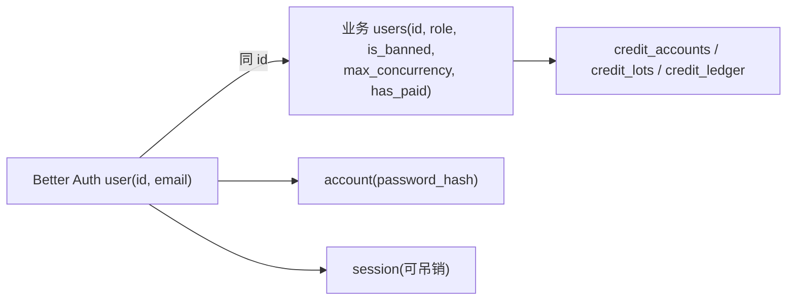

# 6 · 鉴权与会话

> 用 **Better Auth**（email+password、不验邮箱、admin 插件、bcryptjs）落地账号；把**封禁/改密的硬校验**做成「每请求查 DB」、把**注册原子发放**接到 [03-money.md §4.4](03-money.md)。
> 规则真相源：规格 [§4 账号](../redesign-requirements.md) / [§24-1 注册登录错误与忘记密码占位](../redesign-requirements.md)。表关系见 [02-database.md §3.1](02-database.md)。
> 密钥红线：`BETTER_AUTH_SECRET` / `BETTER_AUTH_URL` 只在服务端（[00-overview.md §1.4](00-overview.md)）。

## 6.1 Better Auth 配置

落地形态：email+password（**不验邮箱**，规格 §4「注册即用」）+ **admin 插件**（角色/封禁能力）+ **bcryptjs**（纯 JS、无 native 依赖，适配 serverless 冷启动）。

**钉版避 multi-session CVE**：`better-auth` 与各插件**锁定到经核验的安全版本**（package.json 写死精确版本号，不用 `^`/`~`；CI 跑 `npm audit`），规避历史上 multi-session 插件的会话越权问题。本期**不启用 multi-session 插件**（一个账号一套会话语义足够，少一个攻击面）。

```ts
// src/lib/auth.ts —— 服务端唯一 Better Auth 实例
import { betterAuth } from 'better-auth';
import { admin } from 'better-auth/plugins';
import { Pool, neonConfig } from '@neondatabase/serverless';
import ws from 'ws';
import bcrypt from 'bcryptjs';
import { APIError } from 'better-auth/api';
import { onUserRegistered } from './auth-hooks';   // §6.6 注册发放钩子
import { onSessionCreated } from './auth-hooks';    // §6.6 孤儿兜底（登录补发）

neonConfig.webSocketConstructor = ws;

// Better Auth 自管 user/session/account/verification —— 直连 Neon（与业务库同库，§6.2）
const pool = new Pool({ connectionString: process.env.DATABASE_URL_UNPOOLED });

export const auth = betterAuth({
  database: pool,                                  // pg Pool 适配器
  secret: process.env.BETTER_AUTH_SECRET!,
  baseURL: process.env.BETTER_AUTH_URL!,
  emailAndPassword: {
    enabled: true,
    requireEmailVerification: false,              // 规格 §4：不验邮箱
    minPasswordLength: 6,                          // §6.4 前端文案「密码至少 6 位」
    maxPasswordLength: 72,                         // §6.4 粗过滤（按字符 .length，非字节）；字节防线在下方 password.hash
    autoSignIn: true,                             // §24-1：注册成功自动登录
    password: {
      // 字节限长唯一兜底点：注册与 admin setUserPassword 都必经 ctx.context.password.hash。
      // maxPasswordLength 按字符 .length 校验、拦不住多字节密码在 bcrypt 72 字节处静默截断（§6.4）。
      hash: (pw) => {
        if (new TextEncoder().encode(pw).length > 72)
          throw new APIError('BAD_REQUEST', { message: '密码过长（最多 72 字节）' });
        return bcrypt.hash(pw, 10);
      },
      verify: ({ password, hash }) => bcrypt.compare(password, hash),
    },
  },
  session: {
    expiresIn: 60 * 60 * 24 * 7,                  // 7 天
    updateAge: 60 * 60 * 24,                      // 滚动续期
    cookieCache: { enabled: true, maxAge: 5 * 60 }, // 300s 缓存——敏感路径不吃它（§6.3）
  },
  advanced: {
    // 必须是字符串字面量 'uuid'（不是 () => crypto.randomUUID()）：只有 'uuid' 才让 Better Auth CLI
    // 在 Postgres 把 user.id 列迁成原生 uuid 类型、与业务 users.id（uuid）同型可建外键；
    // 自定义函数只是值生成器、列仍是 text，外键对不齐（§6.2）。
    database: { generateId: 'uuid' },
  },
  plugins: [
    admin({ defaultRole: 'user', adminRoles: ['admin'] }),  // §6.7
  ],
  databaseHooks: {
    user:    { create: { after: onUserRegistered } }, // §6.6 注册成功 after-hook：原子发放
    session: { create: { after: onSessionCreated } }, // §6.6 孤儿兜底：每次登录校验 credit_accounts 缺则补发（uq_grant_signup 幂等）
  },
});
```

**handler 挂载（与 RR7 衔接）**：Better Auth 暴露一个 catch-all handler，挂到 RR7 的资源路由 `/api/auth/*`（无 UI、只回 JSON）。

```ts
// src/routes/api.auth.$.ts （RR7 资源路由，splat 捕获全部 /api/auth/* 子路径）
import { auth } from '~/lib/auth';
export const loader  = ({ request }: Route.LoaderArgs) => auth.handler(request);
export const action  = ({ request }: Route.ActionArgs) => auth.handler(request);
```

前端用 `better-auth/react` 的 `createAuthClient({ baseURL })` 调 `signUp.email / signIn.email / signOut`；路由表见 [08-frontend.md §9.2](08-frontend.md)。

## 6.2 表对齐（Better Auth user ↔ 业务 users）

| 表 | 归属 | 谁建/管 |
|---|---|---|
| `user` / `session` / `account` / `verification` | Better Auth | 其 **CLI（`@better-auth/cli generate`）/适配器** 生成 schema；**不在 `src/db/schema.ts` 重复定义**（[02-database.md §3.4](02-database.md)），但落**同一 Neon 库** |
| `users`（业务） | 业务 | `src/db/schema.ts`（[02-database.md §3.2](02-database.md)）：`role / max_concurrency / is_banned / has_paid` 等 |

**对齐策略（明确定）**：

- **以 Better Auth `user.id` 为主键真相源**。Better Auth 配 **`advanced.database.generateId: 'uuid'`**（字符串字面量，§6.1），CLI 据此把 `user.id` 列迁成 Postgres **原生 uuid 类型**，与业务 `users.id`（uuid 主键）**同型同值**、可建外键。
- 业务 `users.id` **去掉 DB DEFAULT**（[02-database.md §3.2](02-database.md)：`uuid PRIMARY KEY` 无 default），**恒由注册 after-hook 写入该 `user.id`**（§6.6），不另生成 UUID → 二者 **id 全程一致、均为同一 UUID 字符串**，可直接 join、外键引 `users(id)`。
- `account` 表（Better Auth）存 **password_hash / provider**；业务 `users.password_hash` 列**留空或仅冗余**（[02-database.md §3.2](02-database.md) 已注「由 Better Auth/account 管」），改密走 Better Auth、不手改业务列。
- **为何不把业务字段全塞 Better Auth `additionalFields`**：
  1. **钱事务只碰业务表**（`users / credit_*`），与 Better Auth 的 `user/session/account` **互不干扰、各管各事务**（[01-architecture.md §2.1](01-architecture.md) 已述）；混表会让一笔扣费/调账事务被迫去锁鉴权表，放大锁冲突面。
  2. `role / is_banned / max_concurrency` 是**高频热路径读**（入队闸、并发闸、敏感 guard），放在业务 `users` 与 `credit_*` 同库同区一把读，避免和会话签名逻辑耦合。
  3. admin 插件只需 `role`/`banned` 语义，我们让它读业务 `users.role`/`users.is_banned`（adminRoles 映射），无需把全部业务字段灌进鉴权表。



## 6.3 会话与硬校验（DB 可吊销 + 敏感路径每请求查 DB）

- **会话存 DB（可吊销）**：`session` 表为权威，登出/封禁/改密可**删除会话行**立即失效——这是「封禁即下线」「改密强制重登」的基础（§6.5）。
- **cookieCache 300s 是性能优化、不是安全边界**：普通读路径（首屏 SSR、列表）可吃 300s 缓存；但**敏感/资金/封禁相关路径必须每请求查 DB**，绕开缓存窗口，否则会出现「已封禁用户在 5 分钟内仍能下单/扣费」的漏洞。

**敏感路由 guard helper（伪代码）**：所有需要"现时真状态"的路径（`POST /api/generate`、`/api/redeem`、所有 `/api/admin/*`）必须经它。

```ts
// src/lib/guard.ts
type Ctx = { userId: string; role: 'user'|'admin'; maxConcurrency: number };

// 普通受保护路由：可吃 cookieCache（快）
export async function requireUser(request: Request): Promise<Ctx> {
  const s = await auth.api.getSession({ headers: request.headers });   // 可命中 300s 缓存
  if (!s) throw httpError(401, '请先登录');
  return toCtx(s);
}

// 敏感路由：强制每请求查 DB，不吃缓存，并核对 is_banned
export async function requireUserStrict(request: Request): Promise<Ctx> {
  // 会话校验走 Better Auth server API：disableCookieCache 关掉 300s 缓存，每请求查 DB 会话；
  // 不裸查 session 表列名（Better Auth 默认 camelCase 列，裸 SQL 大概率查不到）——会话存活/吊销由 Better Auth 判定。
  const s = await auth.api.getSession({ headers: request.headers, query: { disableCookieCache: true } });
  if (!s) throw httpError(401, '会话已失效，请重新登录');
  // 再查业务表（snake_case，OK）：现时未封禁 + 取热路径字段
  const row = await sql`
    SELECT id, role, max_concurrency, is_banned
    FROM users
    WHERE id = ${s.user.id}
    LIMIT 1`;
  if (row.length === 0)      throw httpError(401, '会话已失效，请重新登录');
  if (row[0].is_banned)      throw httpError(403, '账号已被封禁，请联系站长');
  return { userId: row[0].id, role: row[0].role, maxConcurrency: row[0].max_concurrency };
}
```

> 入队闸（[03-money.md §4.9](03-money.md)）前必须先过 `requireUserStrict`：把封禁/失效会话挡在「花 compute」之前。

## 6.4 密码策略

| 约束 | 值 | 落点 |
|---|---|---|
| 最小长度 | **≥ 6 位** | 前端 Zod 校验 + 文案「密码至少 6 位」（§24-1）；Better Auth `minPasswordLength:6` 兜底 |
| 最大长度 | **≤ 72 字节** | 注册**和**改密都限；前端 Zod 预校验 + 服务端**字节限长在 `password.hash` 内强制断言**（§6.1，注册与 admin setUserPassword 都必经）。`maxPasswordLength:72` 仅作粗过滤（按字符 `.length`、非字节），不提供字节防线 |
| 注册成功 | **自动登录** | `autoSignIn:true`（§6.1），注册后直接进主页（§24-1） |

**为什么限 72 字节（关键）**：bcrypt **静默截断超过 72 字节的输入**——若不限长，「同前 72 字节、后段不同」的两个密码会哈希相同，登录校验把它们当同一密码，是真实越权风险。注意是 **字节** 不是字符（中文/emoji 一字符占 3~4 字节）。**Better Auth `maxPasswordLength` 按字符 `.length` 校验、不是字节**，拦不住多字节密码越过 72 字节——故**字节防线唯一兜底点是 §6.1 `password.hash` 内的 `TextEncoder` 字节断言**（注册与 admin `setUserPassword` 都必经此哈希函数）。前端 Zod 用浏览器安全的 `new TextEncoder().encode(pw).length <= 72`（不用 Node-only 的 `Buffer.byteLength`）只是预校验、给即时反馈，不能替代服务端断言。

```ts
// src/contracts/auth.ts —— 前后端共用
import { z } from 'zod';
const password = z.string()
  .min(6, '密码至少 6 位')
  .refine((p) => new TextEncoder().encode(p).length <= 72, '密码过长（最多 72 字节）');  // 浏览器安全，不用 Buffer
export const signUpSchema = z.object({ email: z.string().email(), password });
export const resetPwSchema = z.object({ password });   // 改密同样限长
```

> 错误码：邮箱已注册 → **409**「该邮箱已注册，请直接登录」+「去登录」（§24-1，契约见 [07-api.md §8.4](07-api.md)）。

## 6.5 封禁与改密（admin 操作 + 吊销会话 + 审计）

所有操作走 admin API（§6.7 guard），状态变更 + **吊销会话** + 写 `audit_log`（[09-admin.md §10.6](09-admin.md)）。**吊销会话一律走 Better Auth admin 插件 API**（`banUser` / `revokeUserSessions` / `setUserPassword`），**不裸 `DELETE`/`SELECT` `session` 表**（其列名为 Better Auth 默认 camelCase，裸 SQL 易错且绕过插件语义）。

| 操作 | 动作 | 会话处理 |
|---|---|---|
| **封禁** | Better Auth `banUser`（admin 插件，写 `is_banned`） | `banUser` 自动吊销该用户全部会话（立即下线） |
| **解封** | `UPDATE users SET is_banned=false`（或 `unbanUser`） | 无需动会话（重新登录即可） |
| **改密** | Better Auth `setUserPassword`（重哈希写 `account`） | 紧接 `revokeUserSessions` 吊销全部会话（强制重登） |

```ts
// admin 封禁（src/routes/api.admin.users.$id.ban.ts，先过 requireAdmin §6.7）
const before = await sql`SELECT is_banned FROM users WHERE id=${targetId}`;
await auth.api.banUser({ body: { userId: targetId }, headers });  // 写 is_banned + 吊销全部会话
await sql`INSERT INTO audit_log(admin_id,action,target_type,target_id,before,after,ip,reason)
          VALUES(${adminId},'ban','user',${targetId},${before[0]},${{ is_banned:true }},${ip},${reason})`;
```

```ts
// admin 改密：重设 + 吊销全部会话（强制重登）
await auth.api.setUserPassword({ body: { userId: targetId, newPassword }, headers });  // 经 password.hash：≤72 字节断言（§6.1）+ ≥6 粗校验
await auth.api.revokeUserSessions({ body: { userId: targetId }, headers });            // 强制重登
await sql`INSERT INTO audit_log(admin_id,action,target_type,target_id,after,ip,reason)
          VALUES(${adminId},'reset_pw','user',${targetId},${'{}'}::jsonb,${ip},${reason})`;
```

**红线**：封禁/改密由「Better Auth admin API（状态 + 吊销会话）」与「业务 `audit_log` 写入」两步组成，**分属鉴权与业务两套连接、无法纳入同一 DB 事务**——按**先变更状态/吊销会话、后写审计**的固定顺序执行；若审计写入失败则**补偿重试**（审计行幂等可重入），切不可因审计失败而让账号停在「未封禁却以为已封禁」的态。审计 `before/after` 必填，管理员**不可删改自己的审计记录**（规格 §16）。

## 6.6 注册发放钩子（after-hook → 注册原子发放）

Better Auth **注册成功 after-hook**（`databaseHooks.user.create.after`，§6.1）触发**注册原子发放**，整段照 [03-money.md §4.4](03-money.md)：**单事务** `insert 业务 users + credit_accounts + signup 批次（有效期默认 30 天、取 app_config.grant_valid_days）+ grant 流水`，`uq_grant_signup(ref_id=user_id)` 幂等。

```ts
// src/lib/auth-hooks.ts
export async function onUserRegistered(user: { id: string; email: string }) {
  await tx(async (c) => {
    // 业务 users 行 id 复用 Better Auth user.id（§6.2 对齐策略）
    await c.query(`INSERT INTO users(id,email) VALUES($1,$2) ON CONFLICT (id) DO NOTHING`, [user.id, user.email]);
    await c.query(`INSERT INTO credit_accounts(user_id,balance_mp) VALUES($1,$2) ON CONFLICT (user_id) DO NOTHING`, [user.id, GRANT_MP]);
    await c.query(`INSERT INTO credit_lots(user_id,source,granted_mp,remaining_mp,expires_at)
                   VALUES($1,'signup',$2,$2, now() + ($3 || ' days')::interval)`, [user.id, GRANT_MP, grantValidDays]);
    await c.query(`INSERT INTO credit_ledger(user_id,entry_type,amount_mp,balance_after_mp,ref_type,ref_id)
                   VALUES($1,'grant',$2,$2,'signup',$1) ON CONFLICT DO NOTHING`, [user.id, GRANT_MP]);  // uq_grant_signup
    await c.query(`INSERT INTO events(type,user_id,payload) VALUES('user_registered',$1,$2),('credit_granted',$1,$3)`,
                  [user.id, { email: user.email }, { amountMp: GRANT_MP, source: 'signup' }]);
  });
}
// GRANT_MP / grantValidDays 取自 app_config（[00 §1.5](00-overview.md)），不写死。
```

**幂等（钩子失败/重试必守）**：after-hook 可能被重放，或事务半途失败重试。

- 整段所有 insert 都 `ON CONFLICT DO NOTHING`；grant 流水靠 `uq_grant_signup` 保证**重试不重发 0.14**——这是最后硬防线。
- 钩子失败应**让注册失败（向上抛）**，尽量不留「建了 Better Auth user 却没发积分」的态。重试时业务 `users`/`credit_accounts` 命中 conflict 跳过、grant 命中 `uq_grant_signup` 跳过，安全可重入。

**孤儿账号兜底（after-hook 与 Better Auth user 创建不同事务）**：after-hook 在 Better Auth 建完 `user` 行**之后**触发、属另一笔 DB 操作，二者**不在同一事务**——仍可能出现「Better Auth user 已建、但业务发放失败」的孤儿窗口。兜底**有确定挂载点**：

- **每次登录补发（确定挂载点）**：`databaseHooks.session.create.after`（§6.1）触发 `onSessionCreated`——每次会话创建（即每次登录）校验该 user 的 `credit_accounts` 是否存在，**无则补建业务 `users` + `credit_accounts` + signup 批次 + grant 流水**（复用 §6.6 `onUserRegistered` 同段逻辑），靠 `uq_grant_signup(ref_id=user_id)` 幂等保证**已发过的不重发、漏发的补上**。

```ts
// src/lib/auth-hooks.ts —— 孤儿兜底：每次登录校验缺则补发
// ⚠️ Better Auth 把 session 行作第一个实参直接传入（非 { session } 包裹）；签名以此为准。
export async function onSessionCreated(session: { userId: string }) {
  const has = await sql`SELECT 1 FROM credit_accounts WHERE user_id=${session.userId} LIMIT 1`;
  if (has.length === 0) {
    const u = await sql`SELECT id, email FROM users WHERE id=${session.userId} LIMIT 1`;
    await onUserRegistered({ id: session.userId, email: u[0]?.email ?? '' });  // 同段逻辑，uq_grant_signup 幂等
  }
}
```

- **cron 扫孤儿（确定兜底，非"亦可"）**：定时扫描「有 Better Auth `user` 行却缺 `credit_accounts`」的孤儿，批量补发——**不依赖用户再次登录**，覆盖"建号后从不再登录"的极端窗口。靠 `uq_grant_signup` 幂等与登录补发互不重复。cron 与孤儿清理同族调度见 [10-ops-test.md §11.7](10-ops-test.md)。

## 6.7 admin 鉴权

- admin 插件以 **`role='admin'`** 标识管理员（业务 `users.role`，[02-database.md §3.2](02-database.md)）；初始 admin 经普通注册流程建号后**手改 `role='admin'`**（种子，[02-database.md §3.5](02-database.md)）。
- **`/admin/*` 前端路由**（[08-frontend.md §9.2](08-frontend.md)）的 loader 与**全部 `/api/admin/*` API** 必须经 `requireAdmin` guard：

```ts
// src/lib/guard.ts
export async function requireAdmin(request: Request): Promise<Ctx> {
  const ctx = await requireUserStrict(request);    // 每请求查 DB + 未封禁（§6.3）
  if (ctx.role !== 'admin') throw httpError(403, '无权限');
  return ctx;
}
```

- guard 失败：前端路由 loader 抛 403 → 重定向登录/首页；API 返回 403 JSON。后台总览/RBAC 见 [09-admin.md §10.1](09-admin.md)。
- **忘记密码本期占位**（§24-1）：登录页放「忘记密码?」链接 → 提示「请联系站长重置」（无邮件基建，不接 Better Auth 的 reset 邮件流）；真正重置走 §6.5 admin 改密。

## 6.8 鉴权红线清单（落地必守）

- [ ] `better-auth` 及插件**钉精确版本**避 multi-session CVE；本期不启用 multi-session 插件。
- [ ] `BETTER_AUTH_SECRET`/`BETTER_AUTH_URL` 只在服务端；构建期断言不进 bundle（[00 §1.4](00-overview.md)）。
- [ ] 业务 `users.id` 去 DEFAULT，**恒由 after-hook 写入** Better Auth `user.id`（后者配 `generateId:'uuid'`、列迁原生 uuid 同型可建外键）；业务字段不塞 `additionalFields`（钱事务不碰鉴权表）。
- [ ] 敏感路径（生成/兑换/admin）走 `requireUserStrict`/`requireAdmin`：`auth.api.getSession` + `disableCookieCache` 每请求查 DB 会话，再 `SELECT is_banned FROM users`，不裸查 `session` 表、不吃 300s cookieCache。
- [ ] 封禁/改密走 Better Auth admin API（`banUser`/`revokeUserSessions`/`setUserPassword`，立即下线/强制重登），不裸删 `session` 表；按「先吊销后写审计 + 审计失败补偿重试」执行 + 写 `audit_log`。
- [ ] 密码 **≥6 且 ≤72 字节**：字节限长**在 §6.1 `password.hash` 内强制断言**（`TextEncoder`，注册与 admin `setUserPassword` 都必经），`maxPasswordLength` 仅粗过滤（按字符、非字节防线）；防 bcrypt 72 字节截断越权。
- [ ] 注册 after-hook 走 [03-money.md §4.4](03-money.md) 原子发放，`uq_grant_signup` 幂等；钩子失败让注册失败、可安全重入。孤儿兜底**双确定挂载点**：`session.create.after` 每次登录补发 + cron 扫孤儿（不依赖再登录），均靠 `uq_grant_signup` 幂等。
