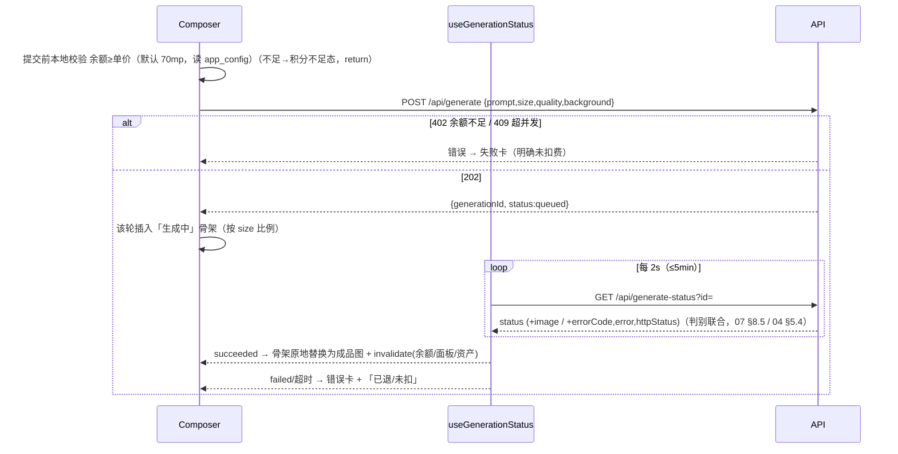

# 9 · 前端架构

> RR7 framework 模式（loader/action/SSR）+ TanStack Query v5 客户端态 + tokens.css 落地。骨架/状态看产品规格 [§3 导航](../redesign-requirements.md)/[§5 五态](../redesign-requirements.md)/[§10 最近](../redesign-requirements.md)/[§11 本次面板](../redesign-requirements.md)/[§12 资产库](../redesign-requirements.md)/[§13 灵感库](../redesign-requirements.md)/[§17 视觉](../redesign-requirements.md)/[§24 交互默认值](../redesign-requirements.md)；**结构**真相源 [wireframes.html](../prototypes/wireframes.html)、**视觉/令牌**真相源 [design-system.html](../prototypes/design-system.html)。技术栈见 [00-overview.md §1.1](00-overview.md)。

## 9.1 RR7 框架模式

React Router 7 **framework 模式**（非 library/data 模式）：路由即模块，每个路由模块可导出 `loader`（服务端取数、SSR 首屏）、`action`（表单/写操作）、`Component`（UI）、`ErrorBoundary`。配 Vite + React 19，`@react-router/dev` 插件接管打包与 SSR。

`vite.config.ts` 形态（Netlify 跑 RR7 framework 模式必需）：`plugins:[reactRouter(), netlifyReactRouter()]`——`reactRouter()` 取自 `@react-router/dev/vite`、`netlifyReactRouter()` 取自 `@netlify/vite-plugin-react-router`（依赖见 [11-structure-roadmap.md §12.4](11-structure-roadmap.md)），后者默认产出 Netlify Serverless Functions(Node)、Edge 才设 `edge:true`；`@react-router/node`、`isbot` 保留。

```ts
// vite.config.ts
import { reactRouter } from "@react-router/dev/vite";
import netlifyReactRouter from "@netlify/vite-plugin-react-router";
export default { plugins: [reactRouter(), netlifyReactRouter()] };
```

```
app/
  root.tsx              # <html> 壳 + 主题(data-theme) + Toast 容器 + 全局 ErrorBoundary
  routes.ts             # 路由表（见 §9.2，集中声明式）
  routes/
    _auth.login.tsx     # action 调 Better Auth
    _app.tsx            # 受保护布局（loader guard，渲染三栏壳）
    _app._index.tsx     # 主对话 /
    _app.c.$id.tsx      # 会话 /c/:id
    ...
  lib/db.server.ts      # server-only：Pool/neon 句柄（见 00-overview §1.3）
  lib/auth.server.ts    # server-only：Better Auth 实例（见 05-auth §6.1）
  queries/              # TanStack Query keys + fetch 封装（client）
```

**server-only 边界（密钥红线 · [00-overview.md §1.4](00-overview.md)）**：

- 文件名带 `.server.ts` 的模块被 RR7/Vite **从客户端 bundle 整体剔除**；`loader`/`action` 函数体也只在服务端跑。DB 句柄、Better Auth 实例、`RELAY_*`/`DATABASE_URL*`/R2 凭据/`BETTER_AUTH_SECRET` 只从 `.server.ts` 引用，**绝不**在 Component 顶层 import。
- 误把 server 模块拖进客户端图（如组件直接 import `db.server`）会被 RR7 编译期报错；再叠 `scripts/assert-no-secrets-in-bundle.ts` 扫 `build/client/` 兜底（[00-overview.md §1.4](00-overview.md)）。
- `loader`/`action` 内直连 DB 走 [00-overview.md §1.3](00-overview.md) 的两种模式：列表/余额只读走 HTTP `neon()`；若 loader 内需事务（少见，写操作尽量交给同步 fn）才用 Pool。

**loader 鉴权 guard 与重定向**：受保护路由统一挂在 `_app.tsx` 父布局下，父 loader 做一次硬校验（查 DB 会话、读封禁态，不吃 cookieCache，见 [05-auth.md §6.3](05-auth.md)），失败即 `throw redirect("/login?next=...")`。

```ts
// app/lib/guard.server.ts
export async function requireUser(request: Request) {
  const session = await auth.api.getSession({ headers: request.headers }); // 硬查 DB
  if (!session) throw redirect(`/login?next=${encodeURIComponent(new URL(request.url).pathname)}`);
  if (session.user.banned) throw redirect("/login?reason=banned");
  return session.user;
}
export async function requireAdmin(request: Request) {
  const user = await requireUser(request);
  if (user.role !== "admin") throw redirect("/"); // 非管理员撵回主页（详见 09-admin §10.1）
  return user;
}
```

> RR7 的 `throw redirect()` / `throw new Response(401)` 在 loader 里是惯用法——抛出即中断渲染并返回响应，无需 `return`。

## 9.2 路由表

集中在 `app/routes.ts` 声明。鉴权列：**公开** = 无需登录；**需登录** = `_app` 父 loader guard；**需 admin** = `requireAdmin`。后台所有页面规则详见 [09-admin.md §10.1](09-admin.md)。

| path | 路由模块 | loader 取数（SSR 首屏） | action | 鉴权 |
|---|---|---|---|---|
| `/login` | `_auth.login` | 已登录则 `redirect("/")` | 登录（调 Better Auth）| 公开 |
| `/register` | `_auth.register` | 同上 | 注册→自动登录→`redirect("/")`（发放钩子见 [05-auth.md §6.6](05-auth.md)）| 公开 |
| `/forgot` | `_auth.forgot` | — | — | 公开（占位：「请联系站长重置」[§24.1](../redesign-requirements.md)）|
| `/` | `_app._index` | 当前用户、余额、最近会话首屏 20、灵感画廊（欢迎态）| — | 需登录 |
| `/c/:id` | `_app.c.$id` | 校验会话归属、该会话对话流（轮次）、本次面板图片 | 提交生成转交 fn（见 §9.4）| 需登录 |
| `/assets` | `_app.assets` | 资产库首页（日期分组首屏 + 默认筛选）| 批量删除 | 需登录 |
| `/inspiration` | `_app.inspiration` | 灵感卡列表（品类 Tab + 已上架）| — | 需登录 |
| `/billing` | `_app.billing` | 余额 + 套餐档卡片（上架、排序）| 兑换码核销（或交 fn）| 需登录 |
| `/account` | `_app.account` | 账号信息（邮箱、注册时间、并发上限）| 改密 | 需登录 |
| `/admin` | `_admin._index` | 看板 7 卡聚合 | — | 需 admin |
| `/admin/codes` | `_admin.codes` | 兑换码批次列表 | 生成/作废/导出 | 需 admin |
| `/admin/users` | `_admin.users` | 用户列表（搜索分页）| 封禁/改密/调积分/调并发 | 需 admin |
| `/admin/inspiration` | `_admin.inspiration` | 灵感卡 CRUD 列表 | 增删改 | 需 admin |
| `/admin/generations` | `_admin.generations` | 生成记录列表（筛选分页）| — | 需 admin |
| `/admin/packages` | `_admin.packages` | 套餐 + 全局参数 + 审计 | CRUD/改参数 | 需 admin |

> 主对话 `/` 与会话 `/c/:id` 共用 `_app` 三栏壳；「新建生成」= 路由到 `/` 并清空 Composer，首次提交成功后服务端建 `conversation` 并 `navigate(/c/:newId)`（[§10](../redesign-requirements.md)）。后台页面挂独立 `_admin` 布局（自建、贴 design-system，[09-admin.md §10.1](09-admin.md)）。

**站内通知铃铛**（非独立路由，挂 `_app` 顶栏常驻组件）：顶栏铃铛入口 + 未读红点 badge，下拉列表走 TanStack Query（不入 SSR loader），消费 `GET /api/notifications?unread=1`（[07-api.md §8.3](07-api.md)）；组件细节见 §9.6。当前唯一通知类型为「图片到期前 1 天」（`image_expiring`，cron 预扫入 `notifications` 表，[02-database.md §3.2](02-database.md) / [10-ops-test.md §11.7](10-ops-test.md)）；积分到期提示不入此表、走 §9.7 的 `expiringSoon` 实时字段。

## 9.3 TanStack Query v5

**与 RR7 loader 分工（不重叠）**：

| 关注点 | 谁负责 |
|---|---|
| 首屏/路由导航数据（SSR、SEO 不需但要快、随 URL 变） | **RR7 loader** —— 列表第一页、余额初值、会话对话流 |
| 客户端交互态：job 轮询、乐观更新、跨页缓存复用、分页「加载更多」 | **TanStack Query** |
| 写操作（表单提交） | RR7 `action`（导航型）或 TanStack `useMutation`（局部、不导航，如兑换/存资产库）|

loader 取到的首屏数据可作为对应 query 的 `initialData`（用同一 query key），避免「SSR 渲染一份 → 客户端再拉一份」抖动。

**job 态短轮询**（核心，串 [04-generation-pipeline.md §5.4](04-generation-pipeline.md)）：

```ts
function useGenerationStatus(generationId: string | null) {
  const startedAt = useRef(Date.now());
  return useQuery({
    queryKey: ["generation", generationId],
    enabled: !!generationId,
    queryFn: () => api.getGenerationStatus(generationId!),
    refetchInterval: (q) => {
      const s = q.state.data?.status;
      if (s === "succeeded" || s === "failed") return false;        // 终态停轮询
      if (Date.now() - startedAt.current > 5 * 60_000) return false; // 满 5min 停（前端兜底，§5.5）
      return 2_000;                                                  // 每 2s 轮询
    },
    refetchIntervalInBackground: false,
  });
}
```

> 前端满 5min 仅释放 UI 判失败；**权威终态判定在服务端 cron**（[03-money.md §4.6](03-money.md) / [04-generation-pipeline.md §5.5](04-generation-pipeline.md)）。

**query keys 约定**（统一收在 `app/queries/keys.ts`，分页用游标/页码入 key）：

| key | 用途 | 失效来源 |
|---|---|---|
| `["me","balance"]` | 顶部余额（常驻） | 兑换成功、生成成功（扣费后） |
| `["generation", id]` | 单 job 态轮询 | 自身终态 |
| `["conversation", id, "images"]` | 本次面板图片 | 该会话生成成功 |
| `["conversations", { cursor }]` | 最近会话分页 | 新建/续聊 |
| `["assets", { range, cursor }]` | 资产库分页（含日期筛选参数） | 删除、生成成功 |
| `["inspiration", { tab, q }]` | 灵感卡列表 | 后台 CRUD（用户侧只读） |

**mutation 后 invalidate**（强一致写完即刷新派生视图）：

- 兑换成功 → `invalidate(["me","balance"])` + Toast『积分到账』（[§24.11](../redesign-requirements.md)）。
- 生成成功（轮询拿到 `succeeded`）→ `invalidate(["me","balance"])`（已扣费）+ `invalidate(["conversation", id, "images"])` + `invalidate(["assets"])`。
- 存入资产库 → `invalidate(["assets"])`，按钮置灰、Toast『已存入资产库』（[§24.6](../redesign-requirements.md)）。
- 资产库批量删除 → `invalidate(["assets"])`。

## 9.4 Composer 五态

四态机 + 「积分不足」边界（wireframes 第 3–6 节，规格 [§5](../redesign-requirements.md)）。状态由「当前轮次」的客户端机驱动，**不可取消**（无取消按钮、无「已取消」态，[§5.3](../redesign-requirements.md)）。

| 态 | 触发 | UI（[§5](../redesign-requirements.md) / [§17](../redesign-requirements.md)） |
|---|---|---|
| 欢迎/空 | 新会话、无轮次 | Hero + Composer + 灵感画廊（wireframes 3）|
| 生成中 | 提交得 202、轮询非终态 | 提示词回显 + **宇宙星空动效骨架**（按比例铺满）+ `生成中 M:SS`（wireframes 4，§9.6）|
| 成功 | 轮询 `succeeded` | 骨架替换为成品图 + 该轮操作条（wireframes 5）|
| 失败 | 轮询 `failed` / 满 5min | 错误卡 + 脱敏可读报错 + 重试 + 注明**未扣/已退积分**（按响应 `creditsChargedMp===0` 判定、不靠前端猜）（wireframes 6）|
| 积分不足（边界）| 提交前余额 `< 单价`（默认 70mp，读 `app_config.price_per_image_mp`）| Composer 拦截、按钮态变「积分不足，去充值」→ `/billing`；**不发请求、不入队、不扣费**（[§6](../redesign-requirements.md)）|

**客户端状态流**（提交 → 202 → 轮询 → 替换骨架）：



提交前显示「本次消耗 0.07 积分 / 剩余 Y 积分」（固定 0.07、不写「约」，[§5.1](../redesign-requirements.md)）。Composer 药丸：比例（唯一尺寸入口，§9.6）、高级设置（质量/背景）、参考图 + 与优化提示词为占位「敬请期待」、发送黑色圆形；**模型固定 `gpt-image-2`、审核固定 low**，不出现在 UI（[§5.1](../redesign-requirements.md)）。

**每轮结果操作**（仅作用于该轮，[§5.2](../redesign-requirements.md)）：

| 操作 | 行为 |
|---|---|
| 下载 | 取该轮 `public_url` 直下 |
| 重新生成 | 回填该轮 prompt + size/quality/bg 到 Composer（可改再发），**不自动发** |
| 复制提示词 | 复制该轮 prompt，Toast『已复制』 |
| 查看原始响应（脱敏）| 弹**后端已脱敏的归一化 `error` 文案**（非 v1 那种整包中转 response；服务端不回原始中转响应，详见 [04-generation-pipeline.md §5.4](04-generation-pipeline.md)）（[redaction.ts](../../src/lib/redaction.ts)，[§5.3](../redesign-requirements.md)）|
| 存入资产库 | `useMutation` → invalidate `["assets"]`，成功后置灰（[§24.6](../redesign-requirements.md)）|

## 9.5 tokens 落地

把 [design-system.html](../prototypes/design-system.html) 顶部 `:root` / `[data-theme="dark"]` 两套变量原样落进 `app/styles/tokens.css`，全局 import 一次；主题切换改 `<html data-theme="light|dark">`。组件样式用 **CSS Modules**（`*.module.css`），**取值一律 `var(--token)`、绝不硬编码**色值/间距/圆角（[§17](../redesign-requirements.md)）。

主要 token 组（**值以 [design-system.html](../prototypes/design-system.html) 为准**，此处仅列名 + 形态示意）：

| 组 | token 前缀/名 | 备注 |
|---|---|---|
| 字体 | `--font-sans` / `--font-mono` | `--font-sans` 以 Inter 打头（`Inter, ui-sans-serif, system-ui, …`）：Inter 优先 + 系统回退（不 `@font-face` 加载、装了用没装回退，仍零网络加载）|
| 中性面 | `--bg-canvas` / `--bg-surface` / `--bg-subtle` / `--bg-muted` | 微暖中性灰 |
| 文字 | `--text-primary` / `--text-secondary` / `--text-tertiary` / `--text-inverse` | |
| 边框 | `--border-subtle` / `--border-strong` | 0.5px 细边 |
| 主操作 | `--primary-bg` / `--primary-bg-hover` / `--primary-fg` | 亮=黑底白字，暗反相 |
| 暖色点缀 | `--accent` / `--accent-hover` / `--accent-surface` / `--accent-on-surface` | 仅徽章/选中/链接 hover/推荐档描边 |
| 语义色 | `--success-*` / `--danger-*` / `--info-*` / `--warning-*`（`-text`/`-surface`/`-border`）| `warning` 用于过期提醒黄 |
| 圆角 | `--radius-sm/md/lg/xl/full` | 卡片 lg、输入/下拉 md、药丸/按钮/发送/头像 full |
| 间距 | `--space-1..12`（4px 基准） | |
| 阴影 | `--shadow-xs/sm/md/lg` + `--scrim` | 浮层 md、弹窗/lightbox lg、`--scrim` 遮罩 |
| 宇宙星空 | `--cosmic-top/mid/bot/edge` | **生成态专属，刻意不随明暗反相**（深空恒深，§9.6）|

```css
/* app/styles/tokens.css —— 摘自 design-system.html，值以该文件为准 */
:root, [data-theme="light"]{
  --bg-canvas:#faf9f7; --bg-surface:#fff; --bg-subtle:#f3f2ef;
  --text-primary:#1a1a18; --accent:#c26a3d;
  --radius-lg:16px; --radius-full:999px;
  --space-4:16px; --shadow-md:0 6px 20px rgba(15,17,21,.10);
  --cosmic-top:#1b2740; --cosmic-mid:#131a2e; --cosmic-bot:#0a0d18; /* 不反相 */
}
[data-theme="dark"]{ --bg-canvas:#141310; --bg-surface:#1e1d1a; --text-primary:#f5f3ee; --accent:#e0935e; /* … */ }
```

```css
/* 任意组件 —— 一律 var()，禁硬编码 */
.card{ background:var(--bg-surface); border:.5px solid var(--border-subtle);
  border-radius:var(--radius-lg); box-shadow:var(--shadow-xs); padding:var(--space-5); }
```

> `--cosmic-*` 只给生成中占位用，**不要**在普通明暗组件里引它（它不随主题反相，会在亮色下显黑块）。

## 9.6 关键组件

每个组件结构看 wireframes、视觉看 design-system；用 CSS Modules + `var()`（§9.5）。

| 组件 | 要点 | 真相源 |
|---|---|---|
| **尺寸浮层** | 复用 [GeneratorForm.tsx](../../src/components/GeneratorForm.tsx) 的 6 场景选项（`auto / 1024×1024 / 1024×1536 / 1536×1024 / 1088×1920 / 1920×1088`），选中态线框→实心黑边（[§17](../redesign-requirements.md)）；点比例药丸弹浮层（`--shadow-md`）| wireframes §Composer，[§5.1](../redesign-requirements.md) |
| **高级设置浮层** | 仅质量 + 背景两项（审核固定 low、不出现）| [§5.1](../redesign-requirements.md) |
| **全局 lightbox** | 屏幕居中模态 + `--scrim` 全屏遮罩，点遮罩/× 关闭；**浮层内仅「下载」**（不放再生成）；对话流/本次面板/资产库/灵感库/后台记录通用 | design-system 第 11 节（图片放大预览 lightbox），[§17](../redesign-requirements.md) |
| **通知铃铛** | 顶栏铃铛 + 未读红点 badge（未读数）；点开下拉未读列表，条目走 `image_expiring` payload `{imageId,expiresAt}` 跳对应资产/会话；下拉数据 + 标记已读全走 TanStack Query（`GET /api/notifications?unread=1`、`POST /api/notifications/read`，[07-api.md §8.3](07-api.md)），打开下拉即 `POST .../read`（缺省全标）→ invalidate 未读 query 消红点 | [§9.2](#92-路由表)，[10-ops-test.md §11.7](10-ops-test.md) |
| **本次对话图片面板** | 右侧常驻（≥1024）、对话头部「本次·N」开关；网格 2 列、正方裁剪缩略图、按时间倒序、仅成功图；`<1024` 收抽屉、`<768` 底部抽屉；点缩略图定位/放大；「下载全部」（复用资产库打包 zip、命名 `图像工坊_导出_YYYYMMDD_HHmmss.zip`；亦可退化为逐张单下）+ 单张「存入资产库」| wireframes §对话，[§11](../redesign-requirements.md)/[§24.7](../redesign-requirements.md) |
| **资产库** | 日期 **sticky 分组**（今天/昨天/具体日期）；**精致日期筛选**（快捷今天·近7·近30 + 带日历自定义区间，非朴素下拉，选完自动应用）；「批量管理」后框选+Shift 连选+单击切换，选中浮出**吸底 action bar**（已选 N · 打包 zip 下载 / 删除带确认）| wireframes §资产库，[§12](../redesign-requirements.md)/[§24.8](../redesign-requirements.md)/[§24.9](../redesign-requirements.md) |
| **灵感卡** | 封面为主体的**瀑布流**（原始比例不裁切）；标题/摘要/「用此提示词」半透明渐变浮层叠下半部、品类标签浮左上、按钮 hover 转陶土；点「用此提示词」一键带回 Composer 并滚到底（不自动发，输入框非空先确认替换）| design-system 第 10 节，[§13](../redesign-requirements.md)/[§24.10](../redesign-requirements.md) |
| **Toast** | 右上角（移动端顶部），成功/失败/提示三类（绿/红/中性），自动 3 秒、可手动关；挂 `root.tsx` 全局容器 | design-system，[§17](../redesign-requirements.md)/[§24.11](../redesign-requirements.md) |
| **星空动效骨架** | 生成中占位：深空底（`--cosmic-*`）+ 旋转银河 + 错峰星点 + 偶发掠星 + 角落呼吸光点 + `生成中 M:SS`；按所选比例自适应铺满；**仅 transform/opacity** 动画 + `@media (prefers-reduced-motion: reduce)` 降级为静态深空底 | design-system 第 8 节，[§17](../redesign-requirements.md)/[§24.12](../redesign-requirements.md) |

```css
/* 星空动效降级 —— 红线：reduced-motion 必须降级，且只动 transform/opacity */
@media (prefers-reduced-motion: reduce){
  .cosmicGalaxy, .cosmicStars, .cosmicShoot{ animation:none; }
}
```

## 9.7 数据流

**余额展示**（顶部常驻、点击进 `/billing`，[§3](../redesign-requirements.md)）：loader 给首屏初值 → `["me","balance"]` query 持有 → 兑换/生成成功 mutation `invalidate` 后自动刷新（§9.3）。过期临近（≤3 天）药丸标黄点（`--warning-*`，[§24.5](../redesign-requirements.md)）：黄点显示与否取 `MeResponse.expiringSoon.mp`（string codec，`> 0` 才显），tooltip 取 `expiringSoon.nearestExpiresAt`（`string|null`）渲染「X 积分将于 MM-DD 过期」（X = `mp`/1000、X 与日期均消费该字段、不再悬空；字段来源见 [07-api.md §8.3 / §8.5](07-api.md)）。

**生成 hook 串联**（一个 `useGeneration` 包住提交→轮询→结果）：

```ts
function useGeneration(conversationId: string) {
  const qc = useQueryClient();
  const [activeId, setActiveId] = useState<string | null>(null);
  const submit = useMutation({
    mutationFn: (req: GenReq) => api.generate(conversationId, req), // → 202 {generationId}
    onSuccess: (r) => setActiveId(r.generationId),                  // 切入轮询
  });
  const status = useGenerationStatus(activeId);                     // §9.3 轮询
  useEffect(() => {
    if (status.data?.status === "succeeded") {
      qc.invalidateQueries({ queryKey: ["me","balance"] });
      qc.invalidateQueries({ queryKey: ["conversation", conversationId, "images"] });
      qc.invalidateQueries({ queryKey: ["assets"] });
    }
  }, [status.data?.status]);
  return { submit, status };
}
```

**响应式断点**（[§11](../redesign-requirements.md)/[§24.7](../redesign-requirements.md)）：

| 宽度 | 布局 |
|---|---|
| `≥1024px` | **三栏**：左侧栏 + 对话区 + 右侧「本次图片」面板常驻 |
| `<1024px` | 右侧面板收**抽屉**（头部「本次·N」开关触发）|
| `<768px` | **侧栏也折叠**为图标栏 / 底部抽屉，单列对话 |

## 红线清单（前端）

- [ ] server-only：DB/Key/Auth 只从 `.server.ts` 引用，组件层禁 import；构建期断言兜底（[00-overview.md §1.4](00-overview.md)）。
- [ ] 受保护路由统一走 `_app` 父 loader `requireUser`、后台走 `requireAdmin`；未登录 `redirect("/login?next=")`，封禁号撵出（[05-auth.md §6.3](05-auth.md)）。
- [ ] 图片 URL **只用 R2 `public_url`**，绝不渲染中转临时 URL（[01-architecture.md §2.1](01-architecture.md)）。
- [ ] job 轮询固定 2s、满 5min 必停；终态停轮询（[04-generation-pipeline.md §5.4](04-generation-pipeline.md)）。
- [ ] 提交前余额本地校验拦「积分不足」，但**真权威在服务端 402**（[03-money.md §4.9](03-money.md)）；前端校验仅省一次往返、绝不作为扣费依据。
- [ ] 生成**不可取消**：UI 无取消按钮、无「已取消」态（[§5.3](../redesign-requirements.md)）。
- [ ] 取值一律 `var(--token)`，禁硬编码；`--cosmic-*` 仅生成态用、不随明暗反相。
- [ ] 星空动效仅 transform/opacity + `prefers-reduced-motion` 降级（[§17](../redesign-requirements.md)）。
- [ ] 回前端的中转响应/报错先脱敏（[redaction.ts](../../src/lib/redaction.ts)）。
