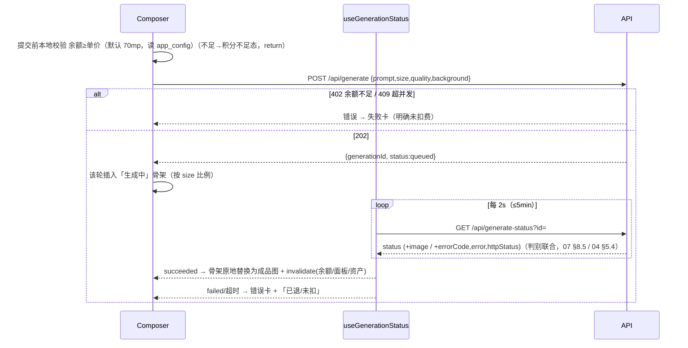

# 9 · 前端架构

> React Router 8 framework 模式（loader/action/SSR）+ TanStack Query v5 客户端态 + tokens.css。骨架/状态看产品规格 [§3 导航](../redesign-requirements.md)/[§5 五态](../redesign-requirements.md)/[§10 最近](../redesign-requirements.md)/[§11 本次面板](../redesign-requirements.md)/[§12 资产库](../redesign-requirements.md)/[§13 灵感库](../redesign-requirements.md)/[§17 视觉](../redesign-requirements.md)/[§24 交互默认值](../redesign-requirements.md)；结构真相源 [wireframes.html](../prototypes/wireframes.html)、视觉/令牌真相源 [design-system.html](../prototypes/design-system.html)。

## 9.1 RR8 框架模式

> **当前实现**：`react-router`/`@react-router/node`/`@react-router/dev` 均为 **8.0.1**，Vite 8，React 19.2.7。生产构建产出 React Router Node SSR，由 Docker `web` 进程启动。

React Router 8 **framework 模式**（非 library/data 模式）：路由即模块，每个路由模块可导出 `loader`、`action`、`Component`、`ErrorBoundary`。配 Vite 8 + React 19，`@react-router/dev` 接管打包与 SSR。

`vite.config.ts` 只启用 `reactRouter()`；Netlify Vite adapter 已不参与构建。

```ts
// vite.config.ts
import { reactRouter } from "@react-router/dev/vite";
export default { plugins: [reactRouter()] };
```

```
app/
  root.tsx              # <html> 壳 + 主题(data-theme) + Toast 容器 + 全局 ErrorBoundary
  routes.ts             # 路由表（见 §9.2，集中声明式）
  routes/
    _auth.login.tsx     # action 调 Better Auth
    _app.tsx            # 受保护布局（loader guard，渲染三栏壳）
    _app._index.tsx     # 主对话 /
    _app.c.$id.tsx      # 会话 /c/:id
    ...
  lib/db.server.ts      # server-only：getSql/getPool 连接工厂（见 00-overview）
  lib/auth.server.ts    # server-only：Better Auth 实例（见 05-auth §6.1）
  queries/              # TanStack Query keys + fetch 封装（client）
```

**server-only 边界（密钥红线 · [00-overview.md](00-overview.md)）**：

- 文件名带 `.server.ts` 的模块被 RR8/Vite 从客户端 bundle 整体剔除；`loader`/`action` 函数体也只在服务端跑。DB、Better Auth、`RELAY_*`/`DATABASE_URL*`/`STORAGE_*`/`BETTER_AUTH_SECRET` 只从 server-only 模块引用。
- 误把 server 模块拖进客户端图会被 RR8 编译期报错；再叠 `assert-no-secrets-in-bundle.ts` 扫 `build/client/` 兜底。
- `loader`/`action` 内直连 DB 走 [00-overview.md](00-overview.md) 的连接工厂：列表/余额使用 `getSql()`；需要事务或行锁时使用 `getPool()`。自托管由 `DATABASE_DRIVER=pg` 选择标准 PostgreSQL pool。

**loader 鉴权 guard 与重定向**：受保护路由统一挂在 `_app.tsx` 父布局下，父 loader 做一次硬校验（查 DB 会话、读封禁态，不吃 cookieCache，见 [05-auth.md §6.3](05-auth.md)），失败即 `throw redirect("/login?next=...")`。

```ts
// app/lib/guard.server.ts
export async function requireUser(request: Request) {
  const session = await auth.api.getSession({ headers: request.headers }); // 硬查 DB
  if (!session) throw redirect(`/login?next=${encodeURIComponent(new URL(request.url).pathname)}`);
  if (session.user.banned) throw redirect("/login?reason=banned");
  return session.user;
}
export async function requireAdmin(request: Request) {
  const user = await requireUser(request);
  if (user.role !== "admin") throw redirect("/"); // 非管理员撵回主页（详见 09-admin §10.1）
  return user;
}
```

> RR8 的 `throw redirect()` / `throw new Response(401)` 在 loader 里会中断渲染并返回响应，无需 `return`。

## 9.2 路由表

集中在 `app/routes.ts` 声明。鉴权列：**公开** = 无需登录；**需登录** = `_app` 父 loader guard；**需 admin** = `requireAdmin`。后台所有页面规则详见 [09-admin.md §10.1](09-admin.md)。

| path | 路由模块 | loader 取数（SSR 首屏） | action | 鉴权 |
|---|---|---|---|---|
| `/login` | `_auth.login` | 已登录则 `redirect("/")` | 登录（调 Better Auth）| 公开 |
| `/register` | `_auth.register` | 同上 | 注册→自动登录→`redirect("/")`（发放钩子见 [05-auth.md §6.6](05-auth.md)）| 公开 |
| `/forgot` | `_auth.forgot` | — | — | 公开（占位：「请联系站长重置」[§24.1](../redesign-requirements.md)）|
| `/` | `_app._index` | 当前用户、余额、最近会话首屏 20、灵感画廊（欢迎态）| — | 需登录 |
| `/c/:id` | `_app.c.$id` | 校验会话归属、该会话对话流（轮次）、本次面板图片 | 提交生成转交 fn（见 §9.4）| 需登录 |
| `/assets` | `_app.assets` | 资产库首页（日期分组首屏 + 默认筛选）| 批量删除 | 需登录 |
| `/inspiration` | `_app.inspiration` | 灵感卡列表（品类 Tab + 已上架）| 标题行「投稿」按钮开 SubmitInspirationModal（用户投稿 UGC，[INSPIRATION-UGC-PLAN.md](INSPIRATION-UGC-PLAN.md)）| 需登录 |
| `/billing` | `_app.billing` | 余额 + 套餐档卡片（上架、排序）| 兑换码核销（或交 fn）| 需登录 |
| `/account` | `_app.account` | 账号信息（邮箱、注册时间、并发上限）| 改密 | 需登录 |
| `/admin` | `_admin._index` | 看板 7 卡聚合 | — | 需 admin |
| `/admin/codes` | `_admin.codes` | 兑换码批次列表 | 生成/作废/导出 | 需 admin |
| `/admin/users` | `_admin.users` | 用户列表（搜索分页）| 封禁/改密/调积分/调并发 | 需 admin |
| `/admin/inspiration` | `_admin.inspiration` | 灵感卡 CRUD 列表 | 增删改 | 需 admin |
| `/admin/inspiration-submissions` | `_admin.inspiration-submissions` | 投稿审核队列（状态 Tab 筛选 + 分页 + 待审计数）| 通过（建卡 + 署名）/ 驳回（填原因）| 需 admin |
| `/admin/generations` | `_admin.generations` | 生成记录列表（筛选分页）| — | 需 admin |
| `/admin/packages` | `_admin.packages` | 套餐 + 全局参数 + 审计 | CRUD/改参数 | 需 admin |

> 主对话 `/` 与会话 `/c/:id` 共用 `_app` 三栏壳；「新建生成」= 路由到 `/` 并清空 Composer，首次提交成功后服务端建 `conversation` 并 `navigate(/c/:newId)`（[§10](../redesign-requirements.md)）。后台页面挂独立 `_admin` 布局（自建、贴 design-system，[09-admin.md §10.1](09-admin.md)）。

**站内通知铃铛**（非独立路由，挂 `_app` 顶栏常驻组件）：顶栏铃铛入口 + 未读红点 badge，下拉列表走 TanStack Query（不入 SSR loader），消费 `GET /api/notifications?unread=1`（[07-api.md](07-api.md)）。通知类型为图片到期 `image_expiring`、后台公告 `announcement` 和灵感审核结果 `inspiration_reviewed`；积分到期提示不入此表，走 `expiringSoon` 实时字段。

## 9.3 TanStack Query v5

**与 RR8 loader 分工（不重叠）**：

| 关注点 | 谁负责 |
|---|---|
| 首屏/路由导航数据（SSR、SEO 不需但要快、随 URL 变） | **RR8 loader** —— 列表第一页、余额初值、会话对话流 |
| 客户端交互态：job 轮询、乐观更新、跨页缓存复用、分页「加载更多」 | **TanStack Query** |
| 写操作（表单提交） | RR8 `action`（导航型）或 TanStack `useMutation`（局部、不导航，如兑换/存资产库）|

loader 取到的首屏数据可作为对应 query 的 `initialData`（用同一 query key），避免「SSR 渲染一份 → 客户端再拉一份」抖动。

**当前任务轮询**：从会话缓存派生全部 `queued/claimed/running` IDs，每批最多 50 个调用
`/api/generate-status?ids=` 并按 `generationId` 合并。单项终态只移除自己；到各自
`deadlineAt` 后做最后一次权威读取，不由浏览器伪造失败态。连续缺失项先刷新会话，仍缺失
才显示 UI-only 无权/不存在状态。

**query keys 约定**（统一收在 `app/queries/keys.ts`，分页用游标/页码入 key）：

| key | 用途 | 失效来源 |
|---|---|---|
| `["me","balance"]` | 顶部余额（常驻） | 兑换成功、生成成功（扣费后） |
| 当前会话 pending IDs | 批量 job 状态轮询 | 单项终态、会话权威刷新 |
| `["conversation", id, "images"]` | 本次面板图片 | 该会话生成成功 |
| `["conversations", { cursor }]` | 最近会话分页 | 新建/续聊 |
| `["assets", { range, cursor }]` | 资产库分页（含日期筛选参数） | 删除、生成成功 |
| `["inspiration", { tab, q }]` | 灵感卡列表 | 后台 CRUD（用户侧只读） |
| `["my-submissions"]` | 我的投稿状态（待审/通过/驳回，`useMySubmissions`） | 投稿提交成功 |

**mutation 后 invalidate**（强一致写完即刷新派生视图）：

- 兑换成功 → `invalidate(["me","balance"])` + Toast『积分到账』（[§24.11](../redesign-requirements.md)）。
- 生成成功（轮询拿到 `succeeded`）→ `invalidate(["me","balance"])`（已扣费）+ `invalidate(["conversation", id, "images"])` + `invalidate(["assets"])`。
- 存入资产库 → `invalidate(["assets"])`，按钮置灰、Toast『已存入资产库』（[§24.6](../redesign-requirements.md)）。
- 资产库批量删除 → `invalidate(["assets"])`。

## 9.4 Composer 五态

四态机 + 「积分不足」边界（wireframes 第 3–6 节，规格 [§5](../redesign-requirements.md)）。状态由「当前轮次」的客户端机驱动，**不可取消**（无取消按钮、无「已取消」态，[§5.3](../redesign-requirements.md)）。

| 态 | 触发 | UI（[§5](../redesign-requirements.md) / [§17](../redesign-requirements.md)） |
|---|---|---|
| 欢迎/空 | 新会话、无轮次 | Hero + Composer + 灵感画廊（wireframes 3）|
| 生成中 | 提交得 202、轮询非终态 | 提示词回显 + **宇宙星空动效骨架**（按比例铺满）+ `生成中 M:SS`（wireframes 4，§9.6）|
| 成功 | 轮询 `succeeded` | 骨架替换为成品图 + 该轮操作条（wireframes 5）|
| 失败 | 轮询 `failed` / 满 5min | 错误卡 + 脱敏可读报错 + 重试 + 注明**未扣/已退积分**（按响应 `creditsChargedMp===0` 判定、不靠前端猜）（wireframes 6）|
| 积分不足（边界）| 提交前余额 `< 单价`（默认 70mp，读 `app_config.price_per_image_mp`）| Composer 拦截、按钮态变「积分不足，去充值」→ `/billing`；**不发请求、不入队、不扣费**（[§6](../redesign-requirements.md)）|

**客户端状态流**（提交 → 202 → 轮询 → 替换骨架）：



提交前显示「本次消耗 0.07 积分 / 剩余 Y 积分」（固定 0.07、不写「约」，[§5.1](../redesign-requirements.md)）。Composer 药丸：比例（唯一尺寸入口，§9.6）、高级设置（质量/背景）、参考图（**图生图，已激活**，见下）、优化提示词为占位「敬请期待」、发送黑色圆形；**模型固定 `gpt-image-2`、审核固定 low**，不出现在 UI（[§5.1](../redesign-requirements.md)）。

**参考图药丸 → 图生图（i2i，④b 已实现）**：参考图药丸从占位改为**可上传**——点击选图（魔数嗅探校验、≤4MB）→ 出**缩略图预览** + 移除按钮，进入「图生图模式」；生成中**锁定**（不可换图/移除，与提交按钮同步禁用）。上传走 `POST /api/uploads`（`requireUserStrict` + `sniffImageMime` 魔数嗅探 + ≤4MB + 每用户 40/10min 限流，[07-api.md §8](07-api.md)），返回 `inputImageKey`（`uploads/<userId>/…`，owner-scope）。提交时由 `useGeneration` 串「先传图换 key、再入队」（见 §9.7）。**参考图用后即弃**：成功才清空，孤儿（未入队的上传）靠 cron 回收。

**每轮结果操作**（仅作用于该轮，[§5.2](../redesign-requirements.md)）：

| 操作 | 行为 |
|---|---|
| 下载 | 取该轮 `public_url` 直下 |
| 重新生成 | 回填该轮 prompt + size/quality/bg 到 Composer（可改再发），**不自动发** |
| 复制提示词 | 复制该轮 prompt，Toast『已复制』 |
| 查看原始响应（脱敏）| 弹**后端已脱敏的归一化 `error` 文案**（非 v1 那种整包中转 response；服务端不回原始中转响应，详见 [04-generation-pipeline.md §5.4](04-generation-pipeline.md)）（[redaction.ts](../../src/lib/redaction.ts)，[§5.3](../redesign-requirements.md)）|
| 存入资产库 | `useMutation` → invalidate `["assets"]`，成功后置灰（[§24.6](../redesign-requirements.md)）|

## 9.5 tokens 落地

把 [design-system.html](../prototypes/design-system.html) 顶部 `:root` / `[data-theme="dark"]` 两套变量原样落进 `app/styles/tokens.css`，全局 import 一次；主题切换改 `<html data-theme="light|dark">`。组件样式用 **CSS Modules**（`*.module.css`），**取值一律 `var(--token)`、绝不硬编码**色值/间距/圆角（[§17](../redesign-requirements.md)）。

主要 token 组（**值以 [design-system.html](../prototypes/design-system.html) 为准**，此处仅列名 + 形态示意）：

| 组 | token 前缀/名 | 备注 |
|---|---|---|
| 字体 | `--font-sans` / `--font-mono` | `--font-sans` 以 Inter 打头（`Inter, ui-sans-serif, system-ui, …`）：Inter 优先 + 系统回退（不 `@font-face` 加载、装了用没装回退，仍零网络加载）|
| 中性面 | `--bg-canvas` / `--bg-surface` / `--bg-subtle` / `--bg-muted` | 微暖中性灰 |
| 文字 | `--text-primary` / `--text-secondary` / `--text-tertiary` / `--text-inverse` | |
| 边框 | `--border-subtle` / `--border-strong` | 0.5px 细边 |
| 主操作 | `--primary-bg` / `--primary-bg-hover` / `--primary-fg` | 亮=黑底白字，暗反相 |
| 暖色点缀 | `--accent` / `--accent-hover` / `--accent-surface` / `--accent-on-surface` | 仅徽章/选中/链接 hover/推荐档描边 |
| 语义色 | `--success-*` / `--danger-*` / `--info-*` / `--warning-*`（`-text`/`-surface`/`-border`）| `warning` 用于过期提醒黄 |
| 圆角 | `--radius-sm/md/lg/xl/full` | 卡片 lg、输入/下拉 md、药丸/按钮/发送/头像 full |
| 间距 | `--space-1..12`（4px 基准） | |
| 阴影 | `--shadow-xs/sm/md/lg` + `--scrim` | 浮层 md、弹窗/lightbox lg、`--scrim` 遮罩 |
| 宇宙星空 | `--cosmic-top/mid/bot/edge` | **生成态专属，刻意不随明暗反相**（深空恒深，§9.6）|

```css
/* app/styles/tokens.css —— 摘自 design-system.html，值以该文件为准 */
:root, [data-theme="light"]{
  --bg-canvas:#faf9f7; --bg-surface:#fff; --bg-subtle:#f3f2ef;
  --text-primary:#1a1a18; --accent:#c26a3d;
  --radius-lg:16px; --radius-full:999px;
  --space-4:16px; --shadow-md:0 6px 20px rgba(15,17,21,.10);
  --cosmic-top:#1b2740; --cosmic-mid:#131a2e; --cosmic-bot:#0a0d18; /* 不反相 */
}
[data-theme="dark"]{ --bg-canvas:#141310; --bg-surface:#1e1d1a; --text-primary:#f5f3ee; --accent:#e0935e; /* … */ }
```

```css
/* 任意组件 —— 一律 var()，禁硬编码 */
.card{ background:var(--bg-surface); border:.5px solid var(--border-subtle);
  border-radius:var(--radius-lg); box-shadow:var(--shadow-xs); padding:var(--space-5); }
```

> `--cosmic-*` 只给生成中占位用，**不要**在普通明暗组件里引它（它不随主题反相，会在亮色下显黑块）。

## 9.6 关键组件

每个组件结构看 wireframes、视觉看 design-system；用 CSS Modules + `var()`（§9.5）。

| 组件 | 要点 | 真相源 |
|---|---|---|
| **尺寸浮层** | 复用 [sizeOptions.ts](../../src/components/composer/sizeOptions.ts) 的 6 场景选项（`auto / 1024×1024 / 1024×1536 / 1536×1024 / 1088×1920 / 1920×1088`），选中态线框→实心黑边（[§17](../redesign-requirements.md)）；点比例药丸弹浮层（`--shadow-md`）| wireframes §Composer，[§5.1](../redesign-requirements.md) |
| **高级设置浮层** | 仅质量 + 背景两项（审核固定 low、不出现）| [§5.1](../redesign-requirements.md) |
| **全局 lightbox** | 屏幕居中模态 + `--scrim` 全屏遮罩，点遮罩/× 关闭；**浮层内仅「下载」**（不放再生成）；对话流/本次面板/资产库/灵感库/后台记录通用 | design-system 第 11 节（图片放大预览 lightbox），[§17](../redesign-requirements.md) |
| **通知铃铛** | 顶栏铃铛 + 红点 badge（**只计未读** read_at IS NULL）；点开下拉**拉全部近 50 条（含已读，看完仍保留）**，已读灰显、未读淡陶土高亮；按 `type` 分支：`image_expiring`（payload `{imageId,expiresAt}`）点跳资产库、`announcement`（payload `{title,body,link?}`）**点弹详情 Modal**（完整正文 + link 内站 navigate/外链 window.open + 知道了，关闭不删通知）、`inspiration_reviewed`（payload `{status,title,reason?,inspirationId?}`）**Lightbulb 图标 + 通过/驳回文案**（驳回带 reason）、点跳 `/inspiration`（投稿审核结果，[INSPIRATION-UGC-PLAN.md](INSPIRATION-UGC-PLAN.md)）；数据 + 标记已读走 TanStack Query（`GET /api/notifications`〔缺省全部，loader 仍兼容 `?unread=1`〕、`POST /api/notifications/read`，[07-api.md §8.3](07-api.md)），打开下拉即 `POST .../read`（缺省全标）→ invalidate 消红点但**条目保留可反复点开**。**②（2026-06-22）**：`image_expiring` 在 cron 删图时连带删除（`deleteExpiredImages`），避免到期提醒滞留 | [§9.2](#92-路由表)，[10-ops-test.md §11.7](10-ops-test.md) |
| **本次对话图片面板** | 右侧常驻（≥1024）、对话头部「本次·N」开关；网格 2 列、正方裁剪缩略图、按时间倒序、仅成功图；`<1024` 收抽屉、`<768` 底部抽屉；点缩略图定位/放大；「下载全部」（复用资产库打包 zip、命名 `图像工坊_导出_YYYYMMDD_HHmmss.zip`；亦可退化为逐张单下）+ 单张「存入资产库」| wireframes §对话，[§11](../redesign-requirements.md)/[§24.7](../redesign-requirements.md) |
| **资产库** | 日期 **sticky 分组**（今天/昨天/具体日期）；**精致日期筛选**（快捷今天·近7·近30 + 带日历自定义区间，非朴素下拉，选完自动应用）；「批量管理」后框选+Shift 连选+单击切换，选中浮出**吸底 action bar**（已选 N · 打包 zip 下载 / 删除带确认）| wireframes §资产库，[§12](../redesign-requirements.md)/[§24.8](../redesign-requirements.md)/[§24.9](../redesign-requirements.md) |
| **灵感卡** | 封面为主体的**瀑布流**（原始比例不裁切，`width/height` 回填预留盒避免抖动）；标题/摘要/「用此提示词」半透明渐变浮层叠下半部、品类标签浮左上、按钮 hover 转陶土；点「用此提示词」一键带回 Composer 并滚到底（不自动发，**直接覆盖输入框不弹确认**，站长定）。**P3-S4**：品类 Tab 由 `/api/inspirations` 的 `categories`（DISTINCT active）动态出 + 「全部」首位；搜索/品类**服务端过滤**（250ms debounce + `keepPreviousData` 防闪，默认视图用 loader initialData）。**署名（UGC）**：卡片 hover 浮层在 `item.submitter` 非空时显「由 X 投稿」（X = 通过时冻结的掩码昵称；站长自建卡 `submitter` 为 `null` 不显，[INSPIRATION-UGC-PLAN.md](INSPIRATION-UGC-PLAN.md)）| design-system 第 10 节，[§13](../redesign-requirements.md)/[§24.10](../redesign-requirements.md) |
| **投稿弹窗** | `SubmitInspirationModal`：从「我的作品」选一张图（`useAssets({range:'all',pageSize:200})`）+ 表单（标题必填、提示词预填原图可改、分类下拉、简介）+「我的投稿」状态列表（`useMySubmissions`，待审/已通过/已驳回 + 驳回原因）；提交走 `POST /api/inspiration-submissions`（**不扣积分**），成功 invalidate `["my-submissions"]`；服务端取权威字段、归属校验、待审上限/限流见 [INSPIRATION-UGC-PLAN.md](INSPIRATION-UGC-PLAN.md) | wireframes §灵感库，[§13.1](../redesign-requirements.md) |
| **Toast** | 右上角（移动端顶部），成功/失败/提示三类（绿/红/中性），自动 3 秒、可手动关；挂 `root.tsx` 全局容器 | design-system，[§17](../redesign-requirements.md)/[§24.11](../redesign-requirements.md) |
| **星空动效骨架** | 生成中占位：深空底（`--cosmic-*`）+ 旋转银河 + 错峰星点 + 偶发掠星 + 角落呼吸光点 + `生成中 M:SS`；按所选比例自适应铺满；**仅 transform/opacity** 动画 + `@media (prefers-reduced-motion: reduce)` 降级为静态深空底 | design-system 第 8 节，[§17](../redesign-requirements.md)/[§24.12](../redesign-requirements.md) |

```css
/* 星空动效降级 —— 红线：reduced-motion 必须降级，且只动 transform/opacity */
@media (prefers-reduced-motion: reduce){
  .cosmicGalaxy, .cosmicStars, .cosmicShoot{ animation:none; }
}
```

## 9.7 数据流

**余额展示**（顶部常驻、点击进 `/billing`，[§3](../redesign-requirements.md)）：loader 给首屏初值 → `["me","balance"]` query 持有 → 兑换/生成成功 mutation `invalidate` 后自动刷新（§9.3）。过期临近（≤3 天）药丸标黄点（`--warning-*`，[§24.5](../redesign-requirements.md)）：黄点显示与否取 `MeResponse.expiringSoon.mp`（string codec，`> 0` 才显），tooltip 取 `expiringSoon.nearestExpiresAt`（`string|null`）渲染「X 积分将于 MM-DD 过期」（X = `mp`/1000、X 与日期均消费该字段、不再悬空；字段来源见 [07-api.md §8.3 / §8.5](07-api.md)）。

**生成 hook 串联**（一个 `useGeneration` 包住提交→轮询→结果；④b 起 `submit(req, file?)` 支持图生图）：

```ts
function useGeneration(conversationId: string) {
  const qc = useQueryClient();
  const [activeId, setActiveId] = useState<string | null>(null);
  const submittingRef = useRef(false);                              // 防双发双扣（同步闸，先于 React 重渲）

  // submit(req, file?)：有 file 先 POST /api/uploads 换 inputImageKey 再入队；
  // 成功才清空 prompt/参考图，失败保留可重试。
  async function submit(req: GenReq, file?: File | null) {
    if (submittingRef.current) return;                              // 双发拦截
    submittingRef.current = true;
    try {
      let inputImageKey: string | undefined;
      if (file) inputImageKey = (await api.upload(file)).inputImageKey; // → uploads/<userId>/…
      const r = await api.generate(conversationId, { ...req, inputImageKey }); // → 202 {generationId}
      setActiveId(r.generationId);                                  // 切入轮询
      return r;                                                     // 调用方拿到成功才清空输入框/参考图
    } finally {
      submittingRef.current = false;
    }
  }

  const status = useGenerationStatus(activeId);                     // §9.3 轮询
  useEffect(() => {
    if (status.data?.status === "succeeded") {
      qc.invalidateQueries({ queryKey: ["me","balance"] });
      qc.invalidateQueries({ queryKey: ["conversation", conversationId, "images"] });
      qc.invalidateQueries({ queryKey: ["assets"] });
    }
  }, [status.data?.status]);
  return { submit, status };
}
```

> 图生图链路全貌（上传 → `inputImageKey` 入队 owner-scope 校验 → claim 回读 → 取字节 → `callRelay /images/edits`）见 [04-generation-pipeline.md §5](04-generation-pipeline.md) / [07-api.md §8](07-api.md)。前端只负责「先传后发、成功才清、`submittingRef` 防双发」。

**响应式断点**（[§11](../redesign-requirements.md)/[§24.7](../redesign-requirements.md)）：

| 宽度 | 布局 |
|---|---|
| `≥1024px` | **三栏**：左侧栏 + 对话区 + 右侧「本次图片」面板常驻 |
| `<1024px` | 右侧面板收**抽屉**（头部「本次·N」开关触发）|
| `<768px` | **侧栏也折叠**为图标栏 / 底部抽屉，单列对话 |

## 9.8 Key 弹窗、本地配置与多任务（2026-07-11）

### 本地配置

新增纯客户端 helper（建议 `src/lib/userApiConfig.ts`）：

```ts
export type CredentialMode = "system" | "custom";
export interface UserApiConfig {
  mode: CredentialMode;
  customApiKey: string;
}

const storageKey = (userId: string) => `image-workshop:api-config:v1:${userId}`;
export function loadUserApiConfig(userId: string): UserApiConfig;
export function saveUserApiConfig(userId: string, value: UserApiConfig): void;
export function clearUserApiConfig(userId: string): void;
```

- 缺失/损坏 JSON 默认 `{mode:"system",customApiKey:""}`；schema 版本不认识也安全回退。绝不把 Key放进 URL、cookie、SSR loader、TanStack Query cache、analytics 或错误。
- 这是明确批准的**明文** `localStorage`，不做伪加密。配置按稳定 user ID 隔离；退出不删，清除按钮才删除并切 system。
- 保存 custom Key 只校验 `trim().length>0` 与最大 500 字符，保存后切 custom；切 system 保留 Key。固定 URL 只读展示且不进入提交 payload。
- `/api/me.customKeyModesEnabled` 是 custom 可用性的服务端权威；配置或 me 尚未 ready 时所有提交控件禁用。false 时保留已存 Key、禁用 custom 保存/提交且不自动切 system。

### 顶部弹窗

- `TopBar` 增加 Lucide `KeyRound` 图标按钮与 tooltip/可访问名称。弹窗用单选/segmented control 表达 system/custom；custom 区含 password 输入、`Eye/EyeOff`、保存、清除和只读 URL。
- system 状态说明按积分计费；custom 明确写“本站不扣积分，第三方计费以服务商规则为准”。不要展示 Key hint、余额验证或“连接测试”。
- 弹窗需有焦点圈、Escape/遮罩关闭、label/description 关联；360px 与桌面均无横向溢出、按钮文字截断或顶栏重叠。

### 生成与批量轮询

- 每次提交从当前 user 配置构造 `{credentialMode, customApiKey?}`。system 不放 `customApiKey`；custom 没 Key 时打开/聚焦弹窗并阻止请求。
- system 本地余额预检查继续存在；custom 不读取 `canAfford`，Composer 显示“不扣积分”。服务端仍是最终权威。
- 防双击 guard 只覆盖一次 enqueue 动作，到 202/错误即释放。custom 可无限制连续提交；system 保留现有同会话单项交互锁，前一项终态前 Composer 禁用。服务端 system 并发只统计 `credential_mode='system'`，custom 不占 system 槽。
- 不再以单个 `activeId` 表示整页生成状态。由当前 conversation cache 派生所有 `queued/claimed/running` IDs，以一个轮询控制器按每批 `<=50` 分片请求并合并，按 `generationId` 更新对应 turn；显式处理 `missingIds`，一个终态只从集合移除自己。
- 同一 ID 连续两次进入 `missingIds` 后刷新权威会话；若仍不存在，将原乐观项收口为 UI-only“任务不存在或无权访问” tombstone 并停止该 ID 的轮询，不伪造服务端失败态，其他任务继续。
- 页面刷新/切回会话从 loader 数据重建 pending 集合；路由离开或标签关闭不取消服务端任务。到 `deadlineAt` 后做最后一次刷新，UI 只接受服务端返回的终态。
- 已打开页面若 custom POST 收到 `503 CUSTOM_KEY_MODES_DISABLED`，立即把 me cache 标为 false 并 invalidate，撤销本次乐观项、打开暂停态弹窗且保留 Key；不得自动重试为 system。

## 前端不变量

- DB、system Key 和任务加密主密钥仅从 server-only 模块引用；custom Key 不进入日志或 Query cache。
- 受保护路由统一校验用户/admin，封禁态每请求生效。
- 所有图片只渲染对象存储 `public_url`。
- 当前会话所有非终态任务走批量轮询；单项终态不影响其他项。
- 余额预检查只用于 system；custom 不因本站余额禁用提交。
- UI 不提供取消态；主题使用设计 token，生成动效遵守 `prefers-reduced-motion`。
- 中转响应和错误先脱敏；360px 与桌面都不得出现 Key 弹窗、多任务卡片重叠或溢出。
